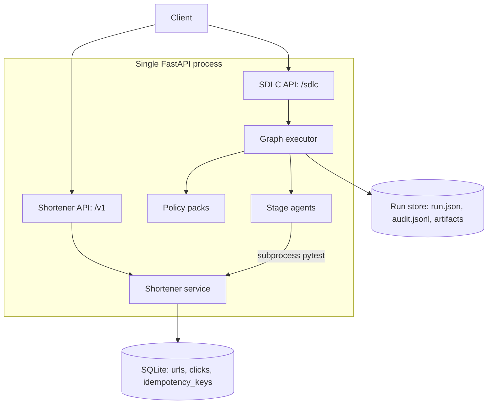
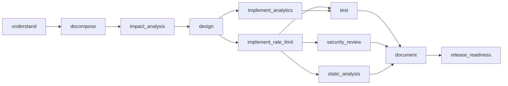

# Agentic SDLC + URL Shortener

A production-style prototype of an **agentic software engineering system**. The scored product is the SDLC orchestrator: it turns a requirement into a reviewable engineering outcome under controlled autonomy. The URL shortener is the **domain artifact** the orchestrator plans against, reasons about, and gates changes to.

Agents execute multi-step work. Humans approve high-impact actions. An agent cannot grant itself release authority — that boundary is enforced in code and proven by a test.

## Quick start

Requires Python 3.11+.

```bash
python3 -m venv .venv && source .venv/bin/activate
pip install -e ".[dev]"
uvicorn app.main:app --reload --port 8000
```

Shorten and resolve a URL:

```bash
curl -s http://localhost:8000/health
curl -s -X POST http://localhost:8000/v1/shorten \
  -H 'Content-Type: application/json' \
  -d '{"url":"https://example.com"}'
# GET /{code} -> 302
```

Run an SDLC job and inspect the governance trail:

```bash
RUN_ID=$(curl -s -X POST http://localhost:8000/sdlc/runs \
  -H 'Content-Type: application/json' \
  -d '{"scenario":"brownfield","requirement":"Add rate limiting and click analytics","auto_approve":true}' \
  | python -c 'import sys,json; print(json.load(sys.stdin)["id"])')
curl -s http://localhost:8000/sdlc/runs/$RUN_ID          # DAG and node states
curl -s http://localhost:8000/sdlc/runs/$RUN_ID/trace    # append-only audit
curl -s http://localhost:8000/sdlc/metrics               # reliability metrics
```

The requirement text drives the plan. That request produces `implement_rate_limit` and `implement_analytics` nodes; a different requirement produces a different graph.

Human approval (the default; `auto_approve` is for CI):

```bash
curl -s -X POST http://localhost:8000/sdlc/runs/$RUN_ID/approve \
  -H 'Content-Type: application/json' \
  -d '{"node_id":"release_readiness","note":"reviewed"}'
```

All three required scenarios, in process, no server needed:

```bash
python -m app.demo
```

Interactive API docs: [http://localhost:8000/docs](http://localhost:8000/docs)

## Architecture

Full design rationale, alternatives considered, and known gaps: [Technical design document](docs/DESIGN.md).

One FastAPI process. Shortener routes under `/v1` plus the `GET /{code}` redirect; orchestrator routes under `/sdlc`.



The graph for a brownfield requirement naming two capabilities:



## Orchestration model

- **Requirement analysis** ([`requirements.py`](app/orchestrator/requirements.py)) normalises free text into named capabilities, ambiguities, and acceptance criteria.
- **Codebase reasoning** ([`codebase.py`](app/orchestrator/codebase.py)) parses the source tree with the stdlib `ast` module to find real endpoints, tables, and modules. Add a route and the impact report changes; nothing is hardcoded.
- **Planner** ([`planner.py`](app/orchestrator/planner.py)) is a pure, cycle-checked function of the scenario *and* the requirement. Capabilities fan out into parallel `implement_*` nodes that join at `test`.
- **Context bus** ([`context.py`](app/orchestrator/context.py)) is the only channel between stages, and it enforces the graph: a node may read an artifact only if it declared a dependency on the node producing it.
- **Entry and exit gates.** Entry is the dependency and autonomy check. Exit asserts every artifact in `produces` exists and validates against its registered schema, then runs the policy scan. A stage that writes nothing fails.
- **Policy packs** ([`policy.py`](app/orchestrator/policy.py)): `security` (secrets, private keys, `eval`, PII), `compliance` (release evidence must exist), `change_control` (a change to auth or retention, or a destructive endpoint, withdraws auto-approval).
- **Reliability.** Bounded retries (2 on `implement`/`test`), rollback from an artifact snapshot, cooperative safe-stop, and real fallback: the optional `static_analysis` gate degrades a run instead of blocking it.
- **Re-planning.** Each node records an `input_hash`. `POST /sdlc/runs/{id}/amend` folds a revised requirement in, adds and removes nodes, and invalidates anything whose inputs changed plus its descendants — while the audit log keeps the original history.
- **Concurrency.** Run writes carry a version and an `flock`; a stale write is refused with `409 run_conflict` instead of silently winning.
- **Observability.** Append-only `audit.jsonl`, atomic `run.json` writes, JSON logs with a request id, and metrics with rates and per-incident MTTR.

Node states: `pending | running | gate_wait | succeeded | failed | retrying | rolled_back | stopped`.

## Three scenarios

| Scenario | Requirement | What it demonstrates |
|---|---|---|
| Greenfield | Build a URL shortener with core APIs | Capability-driven fan-out, parallel join, human release gate |
| Brownfield | Add analytics and rate limiting | `impact_analysis` naming real modules, endpoints, and tables from the AST |
| Ambiguous | Make it enterprise-ready | `understand` gates for a human; approval carries assumptions; additive re-plan |

Scope honesty: the shortener is already implemented, so the prototype is always runnable. The orchestrator does the work being evaluated — it analyses the requirement, reasons over the real codebase, runs the real test suite, applies policy, and gates the release. The `implement_*` stages produce an implementation report mapping capabilities to the modules that host them; they do not generate code. That is a deliberate choice, argued in [the design doc](docs/DESIGN.md#7-alternatives-and-trade-offs).

## URL shortener

- `POST /v1/shorten` — optional `custom_alias`, `ttl_seconds`, `Idempotency-Key`
- `GET /{code}` — 302 plus click capture (referrer and user agent truncated)
- `GET /v1/urls/{code}` — metadata
- `GET /v1/urls/{code}/stats` — clicks, last access, top referrers and agents
- `DELETE /v1/urls/{code}` — removes the URL and its click history
- `GET /health` (liveness), `GET /ready` (database)
- Safety: `http`/`https` only; `javascript:`, `file:`, `data:` and embedded credentials refused; private hosts blockable; aliases that would shadow a real route rejected as `alias_reserved`
- Reliability: per-IP sliding window with LRU eviction to `429` plus `Retry-After`; idempotent replay

## Configuration

Copy [`.env.example`](.env.example) to `.env` to override. Defaults run without any configuration.

| Variable | Default | Purpose |
|---|---|---|
| `DATABASE_URL` | `sqlite:///data/shortener.db` | SQLAlchemy URL; Postgres-ready |
| `RUNS_DIR` | `runs` | Where run state, audits, and artifacts land |
| `RATE_LIMIT_PER_MINUTE` | `30` | Write-path limit per client |
| `ALLOW_PRIVATE_TARGETS` | `true` | Set `false` in production to block loopback and private targets |
| `SDLC_API_KEY` | unset | **Set this in any deployment.** When set, every `/sdlc` route requires `X-API-Key` |
| `CLICK_RETENTION_DAYS` | `30` | Window used by the click purge |
| `DOMAIN_TEST_TARGET` | `tests/test_shortener.py` | Suite the orchestrator's `test` stage executes |
| `LOG_LEVEL` | `INFO` | Log threshold; output is JSON on stderr |

## Testing

```bash
ruff check app tests
pytest -q
```

139 tests. Both commands run in CI on every push across Python 3.11 and 3.12, along with a job that executes all three scenarios with and without the control plane secured.

The suite deliberately targets the properties that are easy to fake:

- A **failing domain suite fails the run** — verified by pointing the test stage at a fixture suite that fails, and confirming the default target still passes so the gate discriminates.
- A stage that writes **nothing** fails its exit gate, and one that writes malformed output fails schema validation.
- Reading an artifact a node did not declare a dependency on **raises**.
- Two concurrent approvals produce **one winner and one 409**, checked over 20 iterations, with the persisted run left coherent.
- An **API-affecting change stops at `gate_wait` even with `auto_approve=true`**.
- Cached metrics equal a **full recompute** field for field.
- Logs never contain the API key or an `Idempotency-Key`.

## Why Python for a Java-heavy brief

The assignment does not specify a language, and this is an agentic-orchestration exercise rather than a framework exercise, so the stack was chosen for the part being evaluated: `ast` in the standard library made real codebase reasoning a few hundred lines, Pydantic gave typed artifact contracts and schema validation at the gate for free, and `asyncio` expressed the parallel-with-join execution directly.

None of the design is language-specific, and the Java equivalent is a straight mapping: Spring Boot with `@RestController` and `@ControllerAdvice` for the error envelope, records plus Bean Validation for artifact schemas, Spring Data JPA for the three tables, `CompletableFuture` or virtual threads for the ready-set fan-out, `@Transactional` with an `@Version` column instead of the file lock and version check, and JUnit 5 with Testcontainers in place of pytest fixtures. The orchestration model — DAG, gates, context bus, policy packs, HITL — transfers unchanged, because none of it depends on Python semantics.

If a Java implementation is the evaluation target, treat this as the design artifact and the port as mechanical.

## How AI assistance was used

The brief asks for AI-assisted work with engineering judgment, so here is the honest accounting.

**Used heavily for:** scaffolding modules against a written plan, generating test bodies once the assertion was specified, writing documentation prose, and mechanical refactors such as threading a new parameter through call sites.

**Rejected or corrected:** a suggestion to wrap the orchestrator in LangGraph, which would have hidden exactly the gate and re-plan logic under evaluation; an initial impact analysis that returned a hardcoded module list, which looked convincing and proved nothing; a first-pass rate limiter with an unbounded key map; an eviction fix that was off by one and was caught only because the test asserted the bound after the insert rather than before.

**The most useful discipline** was refusing to trust a passing test as evidence of integration. Two of the worst defects in the first version were not broken code but correct code nothing called: `produces` was declared on every node and never read, and `fallback_applied` was read and never written. Both passed lint and tests. They were found by grepping for a read site and a write site per field, which is now a standing step, along with breaking each new behaviour on purpose to confirm a test goes red.

## Limitations

Known and deliberate, with the reasoning in [the design doc](docs/DESIGN.md#11-limitations-and-known-gaps).

- Stage agents are deterministic rather than LLM-backed; the adapter boundary is `run_stage(ctx)`
- `implement_*` reports the modules a change targets; it does not write code
- SQLite serialises writes; models are Postgres-ready but there are no migrations
- The rate limiter is per process, so a fleet needs a shared counter
- Metrics are a cached rollup over a directory scan, not a time-series store
- Auth on the control plane is a single shared key, not per-user identity

## Out of scope

Java port, Postgres and Alembic, Docker, Kubernetes, live LLM agents, SSO, multi-tenancy, custom domains, QR codes, autonomous deploy. Each is a judgment call rather than an omission; the design doc says why.

## Build log

- S0: Python project + GitHub remote
- S1: GET /health and /ready
- S2: SQLite Url model, Base62, URL allowlist
- S3: shorten and redirect
- S4: click stats API
- S5: rate limit and Idempotency-Key
- S6: run store on disk
- S7: DAG planner for three scenario types
- S8: create and execute SDLC runs
- S9: parallel test and security_review join
- S10: policy gates on artifacts
- S11: human approval on release
- S12: retry, rollback, safe-stop
- S13: trace and metrics APIs
- S14: stage agents produce artifacts and run pytest
- S15: three scenarios and dynamic re-plan
- S16: technical design document
- P1: requirement analyser and AST codebase reasoning drive the plan
- P2: context bus between stages and enforced artifact contracts
- P3: proven test gate, real fallback, run resume
- P4: optimistic concurrency, control-plane auth, three policy packs
- P5: input hashing with downstream invalidation, amend endpoint, honest metrics
- P6: reserved aliases, deletion and retention, limiter eviction, JSON logging
- P7: CI, dependency-free demo, documentation refresh
