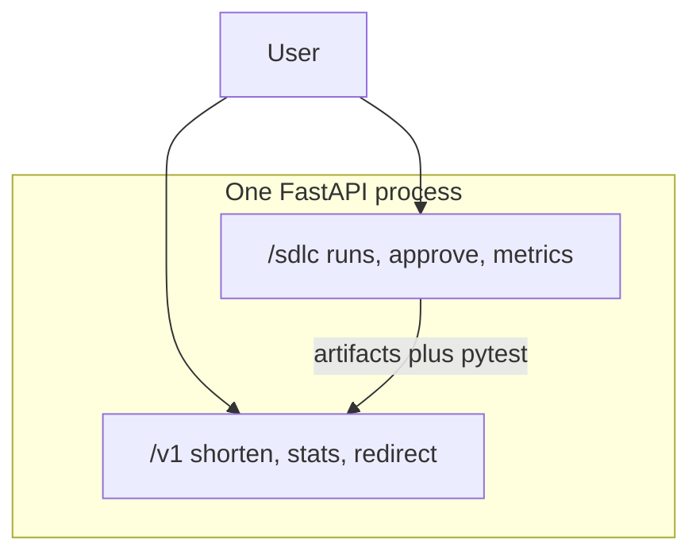
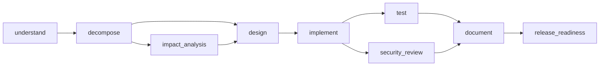

# Agentic SDLC + URL Shortener

A production-style prototype for an **agentic software engineering system**. The scored product is the SDLC orchestrator: it turns a requirement into a reviewable engineering outcome under controlled autonomy. The URL shortener is the **domain artifact** that the orchestrator plans, validates, and reasons about.

Agents execute multi-step work. Humans approve high-impact actions (release, ambiguous assumptions). That is the autonomy boundary.

## Quick start

Requires Python 3.11+.

```bash
python3 -m venv .venv && source .venv/bin/activate
pip install -e ".[dev]"
uvicorn app.main:app --reload --port 8000
```

Health and shorten:

```bash
curl -s http://localhost:8000/health
curl -s -X POST http://localhost:8000/v1/shorten \
  -H 'Content-Type: application/json' \
  -d '{"url":"https://example.com"}'
# GET /{code} → 302
```

SDLC run (CI-style auto-approve) and inspect:

```bash
RUN_ID=$(curl -s -X POST http://localhost:8000/sdlc/runs \
  -H 'Content-Type: application/json' \
  -d '{"scenario":"greenfield","requirement":"Build a URL shortener with core APIs","auto_approve":true}' \
  | python -c 'import sys,json; print(json.load(sys.stdin)["id"])')
curl -s http://localhost:8000/sdlc/runs/$RUN_ID
curl -s http://localhost:8000/sdlc/runs/$RUN_ID/trace
curl -s http://localhost:8000/sdlc/metrics
```

Human approval (default; `auto_approve` is CI-only):

```bash
curl -s -X POST http://localhost:8000/sdlc/runs \
  -H 'Content-Type: application/json' \
  -d '{"scenario":"greenfield","requirement":"Build a URL shortener","auto_approve":false}'
curl -s -X POST http://localhost:8000/sdlc/runs/{id}/approve \
  -H 'Content-Type: application/json' \
  -d '{"node_id":"release_readiness","note":"ship it"}'
```

Interactive API docs: [http://localhost:8000/docs](http://localhost:8000/docs)

In-process three-scenario demo (no running server required):

```bash
python -m app.demo
```

## Architecture

Full design rationale, alternatives considered, and known gaps: [Technical design document](docs/DESIGN.md).

One FastAPI process, port 8000. Shortener routes live under `/v1` and `GET /{code}`. Orchestrator routes live under `/sdlc`.





Brownfield inserts `impact_analysis` after `decompose`. Ambiguous `understand` waits for a human, then **re-plans** (may add `apply_assumptions`) without wiping the audit log.

## Orchestration model

- **DAG planner** (`app/orchestrator/planner.py`): pure function, cycle-checked, scenario-specific.
- **Executor** (`advance`): runs all currently ready nodes in parallel (`asyncio.gather` + `to_thread`), joins before dependents start. HTTP returns at `gate_wait` or a terminal state; it never blocks on a human.
- **Entry/exit gates**: typed artifacts; policy scan after each stage (`sk-`, `password=`, `eval(`). Secrets are not echoed in audit messages.
- **HITL**: `release_readiness` is `human_required`. Ambiguous `understand` is also `human_required`. Approve/reject record `actor=human` and a decision hash (decision lineage).
- **Retry**: `implement` and `test` retry up to 2 attempts.
- **Rollback**: snapshot `artifacts/` before `implement`; restore and mark `rolled_back` if retries are exhausted.
- **Safe-stop**: `POST /sdlc/runs/{id}/stop` cooperatively stops pending/waiting nodes.
- **Audit**: append-only `runs/{id}/audit.jsonl`. `run.json` is written via temp file + `os.replace`.
- **Metrics**: `GET /sdlc/metrics` — success rate, retry count, rollback count, average e2e latency, MTTR (first failure → recovered success). Restart-safe (computed from disk).

Node states: `pending | running | gate_wait | succeeded | failed | retrying | rolled_back | stopped`.

## Three scenarios

Each pack in `scenarios/` shows decompose → orchestrate → validate.

| Scenario | Requirement | What it proves |
|---|---|---|
| Greenfield | Build a URL shortener with core APIs | Full DAG, parallel test ∥ security_review, pytest in-graph |
| Brownfield | Add analytics and rate limiting | `impact_analysis` names real modules (`routes.py`, `models.py`, `rate_limit.py`) |
| Ambiguous | Make it enterprise-ready | Pause with questions; human assumptions; additive re-plan |

Honesty: the shortener is **already complete** so the prototype is always runnable. The orchestrator still produces requirement briefs, DAGs, impact analysis, design, an implementation map, live pytest, security notes, and a human release gate. That is deliberate: unbounded codegen is unreliable for a reviewable demo.

## URL shortener

- `POST /v1/shorten` — optional `custom_alias`, `ttl_seconds`, `Idempotency-Key`
- `GET /{code}` — 302 + click row (referrer/UA truncated)
- `GET /v1/urls/{code}` — metadata
- `GET /v1/urls/{code}/stats` — clicks, last access, top referrers/UAs
- `GET /health` (liveness), `GET /ready` (database)
- Safety: http/https only; reject `javascript:` / `file:` / userinfo; optional private-host block
- Reliability: per-IP sliding window → 429 + `Retry-After`; idempotent replay

## Testing

```bash
ruff check app tests
pytest -q
```

Coverage includes shortener API failures (422/409/410/429), planner DAG shape, parallel join order, policy deny, HITL approve/reject, retry recovery, implement rollback, safe-stop, metrics, and all three scenarios.

The orchestrator `test` stage runs `pytest tests/test_shortener.py` as a subprocess (timeout 60s, no `shell=True`).

## Quality bar

- Pydantic v2 at HTTP/JSON boundaries; Enums for node/run status
- Structured errors `{error: {code, message}}` — no stack traces to clients
- `create_app(settings)` factory; tests use tmp SQLite and tmp `runs_dir`
- UTC timestamps; `secrets` for short codes; SQLAlchemy 2.x mapped models
- No secrets in logs; policy hits log the **rule name** only
- ruff `line-length = 100`

## Risks, trade-offs, assumptions, limitations

**Risks**

- Short codes are enumerable; rate limiting and TTL reduce abuse, not hide URLs.
- Referrers/UAs are PII-adjacent; we truncate to 512 chars.
- In-memory rate limiter does not share across processes.

**Trade-offs**

- SQLite and `create_all` over Postgres/Alembic: one-command demo, schema still explicit in models.
- Mock agents over live LLM: deterministic review, no API keys, typed I/O contracts remain LLM-ready.
- Custom graph runner over LangGraph: every gate is explainable in an interview.

**Assumptions**

- Single-tenant local prototype; `ALLOW_PRIVATE_TARGETS=true` for development.
- `auto_approve=true` is for tests/CI only; production-like use leaves it false.
- Ambiguous default: API key auth, 30-day retention (recorded on approve).

**Limitations / out of scope**

Live LLM, Docker, Alembic, Postgres, LangGraph, SSO, custom domains, QR codes, Kubernetes, autonomous deploy (release is always human-approved).

## Assignment rubric

- Requirement understanding — `requirement_brief.json` on every run
- Task decomposition — `task_dag.json` plus planner DAG with deps and autonomy
- Brownfield reasoning — `impact.json` with real modules/APIs/tables
- Orchestration — DAG, gates, parallel+join, HITL, retry, rollback, stop, re-plan, audit, metrics
- Engineering output — working shortener, OpenAPI `/docs`, tests, this README
- Validation / risk — in-graph pytest, policy pack, security_review artifact
- Controlled autonomy — `auto` vs `human_required`
- Engineering summary — this document

## Build log

- S0: Python project + private GitHub remote
- S1: GET /health and /ready
- S2: SQLite Url model, Base62, URL allowlist
- S3: shorten and redirect
- S4: click stats API
- S5: rate limit and Idempotency-Key
- S6: run store on disk
- S7: DAG planner for three scenario types
- S8: create and execute SDLC runs
- S9: parallel test and security_review join
- S10: policy gates on artifacts
- S11: human approval on release
- S12: retry, rollback, safe-stop
- S13: trace and metrics APIs
- S14: stage agents produce artifacts and run pytest
- S15: three scenarios and dynamic re-plan
