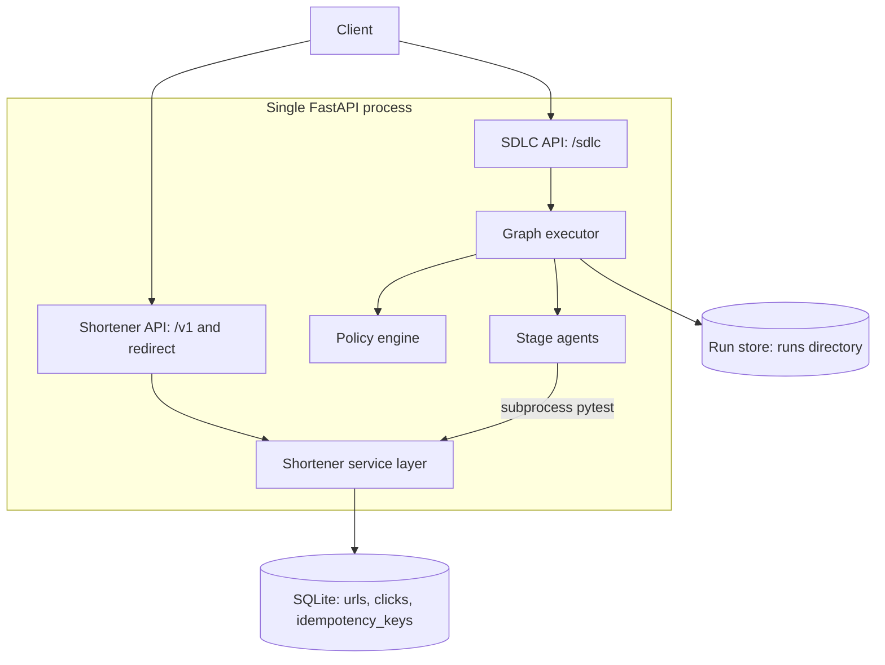
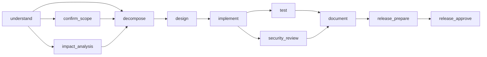
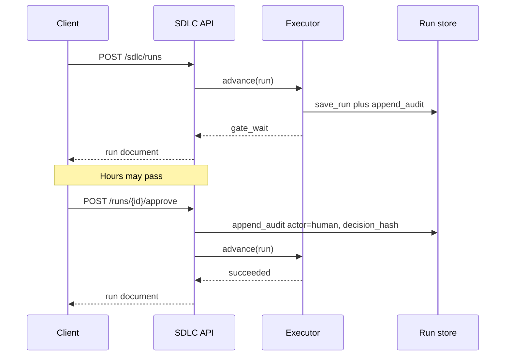
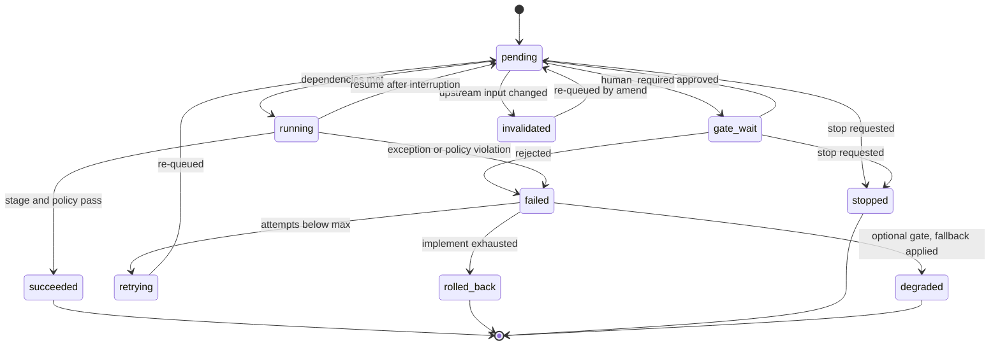

# Technical Design: Agentic SDLC Orchestrator with a URL Shortener Domain Service

| Field | Value |
|---|---|
| Status | Implemented (prototype, tagged `v0.3.0`) |
| Repository | `schintha1/agentic-url-shortener` |
| Related | [README.md](../README.md) |
| Scope | Whole system: orchestration layer and domain service |
| Audience | Engineering reviewers evaluating design judgment |

---

## 1. Overview

This system has two layers, and the distinction drives every decision in this document.

The **SDLC orchestrator** is the product. It accepts a natural-language requirement and drives it through a governed software lifecycle: understand, decompose, design, implement, test, security review, document, release. Execution is a stateful dependency graph with entry and exit gates, parallel branches with synchronization, bounded retries, rollback, safe-stop, policy guardrails, human approval checkpoints, an append-only audit trail, and reliability metrics.

The **URL shortener** is the domain artifact. It is a real, running service with short-code creation, redirects, click analytics, rate limiting, and idempotency. It exists so the orchestrator has a genuine codebase to reason about, validate against, and gate changes to. The orchestrator's `test` stage executes the shortener's real test suite as a subprocess; a failing suite fails the run.

The governing principle: **agents execute multi-step work under defined autonomy boundaries; humans own approval of high-impact actions.**

---

## 2. Goals

1. Turn a requirement into a reviewable engineering outcome with recorded decision lineage.
2. Orchestrate non-linearly: an explicit DAG with gates, not a fixed script.
3. Support sequential and parallel paths with a synchronization barrier.
4. Enforce human approval on high-impact actions (release, ambiguous assumptions).
5. Provide bounded retries, rollback, and cooperative safe-stop.
6. Enforce policy guardrails on generated artifacts before a stage is allowed to pass.
7. Emit append-oriented prototype traces and reliability metrics (success rate, retries, rollbacks, end-to-end latency, MTTR).
8. Re-plan dynamically when upstream decisions change, without discarding audit history.
9. Ship a domain service that is genuinely production-shaped: typed boundaries, structured errors, tests.
10. Run end to end on a laptop with one command and no API keys.

## 3. Non-goals

| Non-goal | Rationale |
|---|---|
| Live LLM agents | Non-deterministic output makes a graded demo unreproducible. Interfaces stay LLM-ready. |
| Unbounded code generation | An agent rewriting the service mid-review is a reliability risk, not a feature. |
| Multi-node distributed orchestration | Single-process semantics are sufficient to demonstrate the control model. |
| Kubernetes, Docker, Terraform | Deployment packaging adds no orchestration signal. |
| Postgres, Alembic migrations | Schema is explicit in ORM models; migration tooling is a scaling concern. |
| Authentication and multi-tenancy | Live shortener has no domain auth or tenants. An orchestrator run may add API-key protection in the isolated workspace. |
| Autonomous deploy | Release is always human-approved by design. |

## 4. Constraints

**Hard constraints** that shaped the design:

- **C1 — No external services.** No database server, message broker, cache, or model API. A reviewer clones and runs.
- **C2 — Single process.** One `uvicorn` command must expose both layers.
- **C3 — Determinism.** Identical inputs must produce identical run outcomes so tests can assert on orchestration behavior.
- **C4 — HTTP must never block on a human.** An approval gate can be open for hours; a request handler cannot wait.
- **C5 — No secrets in the repository.** Policy scanning enforces this on generated artifacts as well as source.
- **C6 — Prototype time budget.** Roughly one working day. Any component that does not demonstrate orchestration or engineering quality was cut.
- **C7 — Python 3.11+.** Modern typing (`X | None`, `datetime.UTC`) without compatibility shims.

---

## 5. High-level design

One FastAPI application. Domain routes are mounted under `/v1` plus a catch-all redirect at `GET /{code}`. Orchestration routes are mounted under `/sdlc`.



Two persistence stores with deliberately different characteristics:

- **Relational (SQLite)** for domain data that needs queries and aggregation (click stats use `GROUP BY`).
- **Filesystem (JSON + JSONL)** for orchestration state, because a run is a document plus an append-only event log, and reviewers should be able to read it with `cat`.

Route registration order matters: the SDLC router is included **before** the shortener router, because `GET /{code}` is a catch-all that would otherwise shadow `/sdlc/...`. See [`app/main.py`](../app/main.py).

---

## 6. Detailed design

### 6.1 Application composition

[`app/main.py`](../app/main.py) exposes `create_app(settings: Settings | None = None) -> FastAPI`. Configuration is a Pydantic `Settings` object ([`app/config.py`](../app/config.py)) read from environment or `.env`.

The factory pattern is load-bearing, not stylistic. Tests construct an app with a temporary SQLite file and a temporary `runs_dir`, so no test shares database state, run state, or rate-limiter state with another. A module-level singleton app would have made rate-limit and idempotency tests order-dependent.

Startup work happens in a lifespan context: create the runs directory, create tables, enable SQLite WAL, build the session factory, and construct the rate limiter into `app.state`. Engine construction is wrapped so that an unreachable database yields a degraded app whose `/ready` returns 503 rather than a process that refuses to boot. `/health` is liveness (always 200 if the process is up); `/ready` is dependency health.

Errors use a single envelope. `AppError(status, code, message, headers)` in [`app/errors.py`](../app/errors.py) is translated by an exception handler into:

```json
{ "error": { "code": "alias_conflict", "message": "Custom alias is already in use" } }
```

Machine-readable codes in use: `url_unsafe`, `alias_conflict`, `not_found`, `expired`, `rate_limited`, `idempotency_conflict`, `code_collision`, `run_not_found`, `invalid_run_id`, `invalid_scenario`, `not_waiting`, `policy_violation`, `not_ready`. Clients never see a stack trace.

### 6.2 Orchestrator data model

[`app/orchestrator/models.py`](../app/orchestrator/models.py) defines the vocabulary as Pydantic models and enums. No magic strings for state.

- `NodeSpec` — the plan: `id`, `stage`, `requires`, `produces`, `autonomy`, `optional`, `max_retries`.
- `NodeState` — the execution record: `spec`, `status`, `attempts`, `fallback_applied`, `started_at`, `finished_at`, `error`.
- `RunState` — the whole run: nodes keyed by id, `scenario`, `requirement`, `status`, governance flags, and reliability counters (`retry_count`, `rollback_count`, `first_failure_at`, `recovered_at`).
- `AuditEvent` — one immutable transition: timestamp, node, from/to status, `actor`, message, `extra`.

Separating `NodeSpec` from `NodeState` is what makes re-planning safe: the planner produces specs, the executor owns state, and a re-plan can replace a spec without resetting attempt counts or losing history.

Node status: `pending`, `running`, `gate_wait`, `succeeded`, `failed`, `retrying`, `rolled_back`, `stopped`.
Run status: `running`, `gate_wait`, `succeeded`, `failed`, `rolled_back`, `stopped`.

### 6.3 Requirement analysis and codebase reasoning

Two pure modules supply the facts every later stage depends on.

[`requirements.py`](../app/orchestrator/requirements.py) turns free text into a `RequirementAnalysis`: named `Capability` values from a marker table, ambiguities from vague-term detection plus decisions a capability implies but the text omits, per-capability acceptance criteria, and risk flags. `analyze(requirement, assumptions=None)` folds a human decision into that result: `auth=api_key|oauth` adds `AUTH`, `retention_days` adds `RETENTION` and a concrete criterion, and a stated rate threshold is not asked again. Deterministic by design, so orchestration behaviour under test never depends on a model call.

[`codebase.py`](../app/orchestrator/codebase.py) parses every module under `app/` with the stdlib `ast` module and extracts:

- **Endpoints** from decorator calls shaped `@router.<method>("path")`, yielding real method, path, and handler triples.
- **Tables** from classes inheriting `Base`, reading `__tablename__` and the annotated column names.
- **Module facts** — classes, functions, imports, and lowercased source for marker matching.

`impacted_by(capabilities)` maps each capability onto the **shortener** modules, endpoints, and tables that contain its markers (`app/shortener/` only). `scan()` still walks the whole `app/` package so endpoint discovery stays honest; control-plane files such as [`auth.py`](../app/orchestrator/auth.py) are not treated as the domain host. Results are cached against a fingerprint of file paths and mtimes, so the cache invalidates when the tree changes.

The acceptance bar is behavioural: add a route to [`routes.py`](../app/shortener/routes.py) and the impact report grows without touching the orchestrator. A test proves this by writing a second route into a temporary package and asserting the endpoint list changes.

### 6.4 Planner

[`app/orchestrator/planner.py`](../app/orchestrator/planner.py) exposes `plan(scenario, requirement) -> list[NodeSpec]`, a pure function with no I/O. Purity means the decomposition logic is unit-testable without HTTP, a database, or a filesystem.

The graph is a function of **two** independent inputs. The scenario shapes the spine; the requirement determines the implementation fan-out. `analyze()` produces the capability list, and each capability becomes its own `implement_<capability>` node depending on `design` and feeding `test`, `security_review`, and `static_analysis`. A requirement naming no capability still yields a valid minimal graph with a single generic `implement` node.



Scenario shaping:

- **Greenfield** — the base graph; `design` depends on `decompose`.
- **Brownfield** — inserts `impact_analysis` **before** `decompose`, so task files are filled from the scan rather than an empty optional read.
- **Ambiguous** — inserts `confirm_scope` (`human_required`) after `understand` has written the brief, so the reviewer reads evidence and then decides.

`understand` is always `auto`. `release_prepare` is `auto` and writes `release_checklist.md`. `release_approve` is always `human_required` and may not be evaluated until that checklist exists. Every produced graph is validated by `assert_acyclic`, which walks dependencies with a visiting/visited set and raises on cycles or unknown dependency ids. A planner bug becomes a loud error instead of a hung executor.

`replan(run, decision)` rebuilds implement fan-out from `analyze(requirement, assumptions)` while keeping human-added nodes such as `apply_assumptions`. Existing nodes keep their ids, statuses, and attempt counts; the audit log is never truncated. The result is re-validated for acyclicity.

### 6.5 Context bus

[`context.py`](../app/orchestrator/context.py) is the only channel between stages. `StageContext` exposes the run, the requirement analysis, the codebase map, and typed artifact access.

The load-bearing rule is that `read()` consults `readable()`, the set of artifacts produced by this node's **transitive dependencies**, and raises `undeclared_dependency` otherwise. Without it the artifacts directory is a global variable and the dependency edges stop constraining anything: a stage could consume output from a node that had not run. `write()` is symmetric — a stage may only write what its own `produces` declares.

This closes a defect in the first version where every stage wrote and none read, so the graph enforced ordering without propagating meaning.

### 6.6 Executor

[`app/orchestrator/executor.py`](../app/orchestrator/executor.py) implements `async def advance(runs_dir, run) -> RunState`. One loop iteration:

1. **Safe-stop check.** If `stop_requested`, move every `pending` or `gate_wait` node to `stopped`, finalize, persist, return.
2. **Readiness.** Collect `pending` nodes whose dependencies all succeeded (or failed with a fallback applied).
3. **Gate check.** If any ready node is `human_required` and `auto_approve` is false, move those nodes to `gate_wait`, set the run to `gate_wait`, persist, and **return** — satisfying constraint C4.
4. **Snapshot.** If `implement` is about to run, copy workspace + artifacts to `snapshot/` once per batch.
5. **Parallel execution.** Run the entire ready set concurrently.
6. **Retry and rollback evaluation.**
7. **Loop** until no nodes are ready or a terminal state is reached.

Concurrency uses `asyncio.gather(..., return_exceptions=True)` over per-node coroutines, each of which offloads synchronous stage work with `asyncio.to_thread`. An exception result is mapped onto that ready node via `_fail_node`; the executor never `continue`s past it and leaves the node `running`. Stage agents perform blocking file and subprocess I/O; running them directly on the event loop would serialize `test` and `security_review` and make the parallel branch a fiction.

Because `document` requires both `test` and `security_review`, and readiness only admits nodes whose dependencies have succeeded, the join is a natural consequence of the readiness rule rather than special-cased barrier code. The test asserts on audit timestamps that `document` starts only after both parallel nodes finish.

The run is persisted after every state transition batch, and each transition appends an audit event. A crash leaves a readable, truthful run document.

### 6.7 Gates and policy

Each stage has two gates.

The **entry gate** is the dependency and autonomy check in the readiness pass, plus a compliance check on `release_prepare` that refuses to evaluate a release when its required evidence is absent.

The **exit gate** does two things in order. `validate_declared` asserts every name in `node.spec.produces` exists, is non-empty, and parses against its model in the [artifact registry](../app/orchestrator/artifacts.py). Then `check_artifacts` scans **only that node's files** for policy violations. Before this existed, `produces` was declared on every node and read by nothing, so a stage that wrote no output still passed.

Policy is split into three named packs so each obligation in the brief is separately visible and separately testable:

- **security** — token-shaped secrets, `password=`, private-key blocks, `eval(`, and PII patterns for email and SSN. Non-UTF-8 files are skipped rather than guessed at.
- **compliance** — `security_review.json` and `test_report.json` must exist before a release gate is evaluated.
- **change control** — a change to the `auth` or `retention` capability, or one touching a `DELETE`/`PUT` endpoint, sets `change_controlled` on the release node and withdraws `auto_approve`.

A violation raises `AppError(422, "policy_violation", "Policy rule failed: <rule_name> (<pack>)")`. The **rule name is reported; the matched text is not.** Echoing the matched string into an audit log written to disk would relocate the secret rather than block it, and a test asserts the secret does not appear in the message.

### 6.8 Human-in-the-loop



`POST /sdlc/runs/{id}/approve` validates that the node is actually in `gate_wait` and returns 409 (`not_waiting`) otherwise, so a stale client cannot force a stage. Approving `release_approve` also 409s if `release_checklist.md` is missing. Before mutating state, it appends an audit event with `actor` from `X-Approver-Id` (else `"human"`), the reviewer's note, and a truncated SHA-256 `decision_hash` of the decision payload. That hash is the decision-lineage primitive: the exact decision that unblocked the run is provable afterward.

The approved node is flipped to `auto` for this run and set back to `pending`, and the executor resumes. For ambiguous runs, approving `confirm_scope` persists assumptions, calls `replan`, and invalidates join stages so design and implement fan-out actually change. `reject` and `stop` write audit events the same way. `auto_approve=true` bypasses gates and exists for CI and the scripted demo only; the default is false, and change control overrides it regardless. Blocking security findings require a `waiver` in the decision.

### 6.9 Reliability controls

- **Retry.** After a node fails, if `attempts < max_retries` the node transitions `failed → retrying → pending`, `retry_count` increments, an audit event is written, and the loop repeats after a 10 ms yield. `implement` and `test` carry `max_retries=2`.
- **Fallback.** An `optional` node that exhausts its retries sets `fallback_applied`, increments `fallback_count`, and emits a `fallback_applied` audit event. The readiness check treats a failed-with-fallback dependency as satisfied and `_finalize` does not count it as a blocking failure, so the run continues **degraded** rather than failing. `static_analysis` is the optional gate: a lint finding should not block a release that passed its tests and security review.
- **Rollback.** `implement` is the only stage with side effects worth undoing. `snapshot_artifacts` copies **workspace + artifacts** once per implement batch (it does not resnapshot between retries). If retries are exhausted, `restore_artifacts` puts both back, so `change.patch` after restore is empty, the node becomes `rolled_back`, and `rollback_count` increments.
- **Safe-stop.** Cooperative and checked between iterations, including when the run is already in `gate_wait`. A `background` create returns the run id without awaiting `advance`; stop cancels that task and terminates an in-flight pytest/ruff subprocess.
- **Resume.** `POST /sdlc/runs/{id}/resume` reloads from disk, resets nodes stranded in `running` back to `pending` with an audit note, and continues. Terminal runs are refused with `409 run_terminal`.
- **Fault injection.** `inject_failure_node` and `inject_failure_count` on the create-run request make retry, rollback, fallback, and MTTR paths testable through the public API rather than through monkeypatching internals. Injection is disabled unless `allow_failure_injection` is set (pytest turns it on).

### 6.10 Re-planning and invalidation

[`invalidation.py`](../app/orchestrator/invalidation.py) makes re-planning mean something. Before a node executes, `compute_input_hash` records a digest of the node spec, current assumptions, and every upstream artifact the node is entitled to read. Only `understand` also hashes the raw requirement, so an amend does not dirty every node.

`POST /sdlc/runs/{id}/amend` accepts a revised requirement, re-runs analysis and the planner, adds new nodes, drops obsolete ones (preserving human-added nodes such as `apply_assumptions`), deletes artifacts of removed nodes, and applies a surgical policy:

1. New `implement_*` nodes are `pending`.
2. Sibling `implement_*` whose capability remains stay `succeeded`.
3. Join stages (`test`, `security_review`, `static_analysis`, `document`, `release_prepare`, `release_approve`) always reset.
4. Refresh stages (`understand`, `decompose`, `design`, …) rewrite their artifacts without forcing sibling implements to re-run.

The audit log is append-only, so the pre-amend history survives and the amend event records what was added, removed, and invalidated.

### 6.11 Concurrency control

`RunState` carries a `version`. `save_run` compares it against the version on disk and raises `409 run_conflict` on a mismatch, writes to a unique `run.json.{pid}.{tid}.tmp`, and the mutating routes wrap read-modify-write in a per-run `threading.Lock` plus an OS file lock (`fcntl.flock` on POSIX, `msvcrt.locking` on Windows) on `runs/{id}/.lock`.

Both are needed: the thread lock serialises same-process writers (flock is process-scoped), the file lock serialises across processes, and the version check catches a writer holding state loaded before the lock was taken. A test drives two concurrent approvals of the same node twenty times and asserts exactly one winner with the loser receiving a clean conflict rather than silently overwriting.

### 6.12 Run store

[`app/orchestrator/store.py`](../app/orchestrator/store.py) owns the layout:

```
runs/{run_id}/
  run.json        current state (overwritten atomically)
  audit.jsonl     append-only transition log with seq/prev_hash
  artifacts/      stage outputs including change.patch
  workspace/      isolated copy of app/ and tests/
  snapshot/       pre-implement copy of artifacts + workspace
```

Two integrity properties:

- **Atomic state writes.** `run.json` is written to `run.json.tmp` and then `os.replace`d, which is atomic on POSIX. A crash mid-write cannot leave truncated JSON that fails to parse on reload.
- **Append-only audit.** `audit.jsonl` is only ever opened in append mode. History cannot be rewritten by a later state change.

`run_id` is matched against a strict UUID regex before being joined to a path. `GET /sdlc/runs/../../etc/passwd` returns a 400 `invalid_run_id` instead of touching the filesystem.

### 6.13 Stage agents

[`app/orchestrator/agents.py`](../app/orchestrator/agents.py) dispatches a stage to a handler that reads its inputs from the context bus and writes only what its node declared. Artifact models live in the [registry](../app/orchestrator/artifacts.py), so shape is enforced at write time and again at the gate.

| Stage | Reads | Produces |
|---|---|---|
| understand | requirement analysis | `requirement_brief.json` |
| confirm_scope | brief (already on disk) | `scope_decision.json` |
| decompose | `requirement_brief.json`, `impact.json` on brownfield | `task_dag.json` |
| impact_analysis | `requirement_brief.json` + codebase scan | `impact.json` |
| design | `requirement_brief.json`, `impact.json`, assumptions | `design.md` |
| implement_* | `design.md` + codebase scan | `implementation_<capability>.json`; adapter nodes also declare `change.patch` |
| test | run config, workspace | `test_report.json` |
| static_analysis | workspace (optional gate) | `static_analysis.json` |
| security_review | codebase scan, analysis, `change.patch` when declared | `security_review.json` (typed findings with severity/blocking) |
| document | `test_report.json`, `security_review.json`, implement reports, patch pointer | `document.md` (rationale, risks, assumptions, limitations, change) |
| release_prepare | test, security, static reports | `release_checklist.md` |
| release_approve | checklist + waiver if blocking | `release_approval.json` |
| apply_assumptions | recorded human decision | `assumptions.json` |

Because each stage consumes upstream output, artifacts vary with the run: `design.md` names the capabilities detected in that requirement and the modules impact analysis found, and `document.md` reports the actual test verdict. Two different requirements cannot produce identical artifacts, and tests assert exactly that.

The `test` stage is not a mock. It runs `python -m pytest <target> -q` as a subprocess in the run workspace, a timeout, no `shell=True`, and output truncated to 8 KB. Adapter-generated tests (`tests/test_export.py`, `tests/test_caching.py`, `tests/test_domain_auth.py`) are included when present. A non-zero exit code raises, which fails the node and — after retries — the run. The target must be a relative path under `tests/`.

`release_prepare` fails when its evidence shows a failure, so the checklist is a gate rather than a formality. Humans approve `release_approve` only after that file exists.

`implement_*` looks up `ctx.node.spec.capability` in the adapter registry. An adapter patches the isolated workspace and records `changed_files`. If AST impact finds the capability at medium/high confidence **in the shortener** and there is no adapter, the report sets `already_present=true` and claims nothing was delivered. If neither adapter nor existing implementation exists, the node fails closed. Adapters exist for export, caching, and auth.

### 6.14 Observability and metrics

`GET /sdlc/runs/{id}/trace` returns the parsed audit log, including `seq` and `prev_hash` so the chain can be walked. [`metrics.py`](../app/orchestrator/metrics.py) computes:

| Metric | Definition |
|---|---|
| `runs_total`, `succeeded`, `failed` | counts over run documents on disk |
| `success_rate` | succeeded / total, `0.0` when there are no runs |
| `retry_count` / `retry_rate` | total retries, and retries per run |
| `rollback_count` / `rollback_rate` | total rollbacks, and per run |
| `fallback_count` / `fallback_rate` | optional-gate degradations, total and per run |
| `e2e_latency_ms_avg` | mean of `updated_at - created_at` |
| `mttr_ms`, `incidents` | mean recovery time per incident, and how many |

MTTR is measured per incident, not per run: `_incident_recovery_times` walks the audit log and pairs each node failure with the next success on that same node, so a run with two independent failures contributes two measurements. The brief asks for retry and rollback **frequency**, hence the rates alongside the counts.

Values are computed from disk and cached in `runs/metrics.json`, refreshed whenever a run reaches a terminal state. `?recompute=true` forces a full scan, and a test asserts the cached response equals the recomputed one field for field so the cache cannot drift from the truth it summarises.

Application logs are JSON on stderr with a `request_id` from [`logging_config.py`](../app/logging_config.py), propagated from an inbound `X-Request-ID` when present. stdout is left for program output so `python -m app.demo` stays machine-readable.

### 6.15 Domain service: URL shortener

**Code generation.** [`app/shortener/codes.py`](../app/shortener/codes.py) draws 7 Base62 characters from `secrets`, giving roughly 3.5 × 10¹² values. `secrets` rather than `random` because predictable short codes would let an attacker enumerate other users' links.

**Creation.** [`app/shortener/service.py`](../app/shortener/service.py) validates the URL, computes optional expiry, and inserts. Custom aliases map an `IntegrityError` to 409 `alias_conflict` rather than pre-checking existence, which would be a time-of-check-to-time-of-use race. Generated codes retry up to five times on collision before returning a 500.

**Redirect.** `GET /{code}` resolves the code (404 unknown, 410 expired), records a click, then returns 302. `record_click` catches `SQLAlchemyError`, rolls back, logs, and continues: **analytics failure must never break the redirect**, which is the service's primary function.

**Analytics.** `GET /v1/urls/{code}/stats` aggregates in SQL with `COUNT`, `MAX`, and `GROUP BY ... ORDER BY ... LIMIT 5`, not by pulling rows into Python.

**Deletion and retention.** `DELETE /v1/urls/{code}` removes the URL and explicitly deletes its clicks, because SQLite does not enforce `ON DELETE CASCADE` unless the pragma is enabled — relying on the declared constraint alone would have left orphaned rows. `purge_clicks_older_than` implements the retention window so the privacy claim has a mechanism behind it.

**URL safety.** [`app/shortener/validation.py`](../app/shortener/validation.py) allows only `http` and `https`; blocks `javascript`, `file`, `data`, and `vbscript`; rejects embedded credentials; and, when `allow_private_targets` is false, blocks loopback, private, link-local, and reserved addresses. Local development defaults to permissive so the demo can shorten `localhost` URLs; production posture is the opposite.

**Reserved aliases.** An alias matching a mounted route (`docs`, `health`, `v1`, `sdlc`, …) is refused with `409 alias_reserved`. The router resolves its own paths first, so such a link could be created but never resolved; failing at creation is the honest behaviour.

**Rate limiting.** [`app/shortener/rate_limit.py`](../app/shortener/rate_limit.py) is a per-IP sliding window applied only to `POST /v1/shorten` — the write path. Exceeding it returns 429 with `Retry-After`, and the check happens before any database work. Keys are pruned when their window expires and evicted least-recently-used past a cap, so a long-lived process facing many clients cannot grow without bound. The limiter lives on `app.state` so tests get a fresh instance.

**Idempotency.** An `Idempotency-Key` header (capped at 128 characters) is stored with a SHA-256 hash of the canonical request body and the serialized response. Lookup uses the same truncated key. Create-and-store of a new URL under a key is serialised with an in-process lock so two concurrent requests cannot both insert. Same key with same body replays the stored response; same key with a different body returns 409 `idempotency_conflict`. The key itself is never logged, and a test asserts it never appears in captured output.

### 6.16 API surface

| Method | Path | Purpose |
|---|---|---|
| GET | `/health` | Liveness |
| GET | `/ready` | Database readiness |
| POST | `/v1/shorten` | Create short URL (alias, TTL, idempotency) |
| GET | `/v1/urls/{code}` | Metadata |
| GET | `/v1/urls/{code}/stats` | Click analytics |
| GET | `/v1/urls/{code}/export` | CSV of clicks (adapter-added in a run workspace) |
| DELETE | `/v1/urls/{code}` | Delete a URL and its click history |
| GET | `/{code}` | 302 redirect and click capture |
| POST | `/sdlc/runs` | Create and advance a run (`background=true` returns immediately) |
| GET | `/sdlc/runs/{id}` | Run state |
| GET | `/sdlc/runs/{id}/trace` | Audit trace |
| GET | `/sdlc/runs/{id}/artifacts` | Artifact manifest |
| GET | `/sdlc/runs/{id}/artifacts/{name}` | Artifact body |
| GET | `/sdlc/runs/{id}/diff` | `change.patch` or 404 |
| POST | `/sdlc/runs/{id}/approve` | Approve a gated node |
| POST | `/sdlc/runs/{id}/reject` | Reject a gated node |
| POST | `/sdlc/runs/{id}/amend` | Revise the requirement and re-plan |
| POST | `/sdlc/runs/{id}/resume` | Resume a run interrupted mid-stage |
| POST | `/sdlc/runs/{id}/stop` | Cooperative safe-stop |
| GET | `/sdlc/metrics` | Reliability metrics |

Every `/sdlc` route requires `X-API-Key` when `SDLC_API_KEY` is configured; the shortener stays open, since it is the public service. OpenAPI is generated by FastAPI at `/docs`.

---

## 7. Alternatives and trade-offs

Each decision lists the options, the choice, the reasoning, and the cost accepted.

### D1 — Single process vs. two deployable services

**Options.** (a) One FastAPI app serving both layers. (b) Separate orchestrator and shortener services communicating over HTTP.

**Chosen: one process.**

Two services would be the correct production topology — independent scaling, independent failure domains, a real network boundary the orchestrator must respect. For this system it would cost a service-discovery story, a second Dockerfile or process manager, cross-service test fixtures, and a reviewer who must start two terminals. None of that produces orchestration signal.

The boundary that actually matters is preserved anyway: [`app/orchestrator/`](../app/orchestrator/) imports nothing from [`app/shortener/`](../app/shortener/). Its only coupling to the domain is a subprocess invocation of the test suite. Splitting later is a packaging exercise, not a refactor.

**Cost accepted.** Shared process memory and lifecycle; a crash takes down both layers.

### D2 — Custom graph runner vs. an orchestration framework

**Options.** (a) Purpose-built DAG runner, roughly 250 lines. (b) LangGraph, Prefect, Temporal, or Airflow.

**Chosen: custom runner.**

A framework brings durable execution, retries, and a UI for free — genuinely valuable at scale. It also brings its own state model and vocabulary, and the specific requirements here are unusual: gates that pause on human approval without holding a request, artifact-level policy scanning between stages, additive re-planning that preserves audit history, and rollback of a filesystem snapshot. Expressing those inside a framework's abstractions means fighting the framework at exactly the points that are being evaluated.

Temporal is the strongest alternative for durable execution, but it requires a server — violating constraint C1.

**Cost accepted.** No scheduler and no built-in UI, and durability is limited to an explicit `resume` call rather than automatic recovery.

### D3 — Deterministic stage agents vs. live LLM calls

**Options.** (a) Deterministic agents producing typed artifacts. (b) LLM-backed agents. (c) Hybrid with a mock fallback.

**Chosen: deterministic agents.**

This is the decision most likely to be challenged, so the reasoning is explicit. The evaluated capability is *orchestration and governance*: does the graph gate correctly, retry correctly, roll back correctly, and record decisions provably? Every one of those properties is verified by asserting on run state. An LLM in the loop makes those assertions flaky, adds latency to every test, requires a key the reviewer may not have, and introduces prompt-injection surface — while adding nothing to the control-flow demonstration.

The architecture stays LLM-ready. `run_stage(stage, run, runs_dir)` is a dispatch boundary with typed artifact contracts. Swapping a handler for an LLM call changes one function; the gates, policy scanning, retries, and approval flow are unchanged, and they are exactly what you would want wrapped around a non-deterministic agent.

**Cost accepted.** The system does not demonstrate natural-language reasoning quality. Requirement briefs are structured rather than inferred.

### D4 — SQLite with `create_all` vs. Postgres with Alembic

**Options.** (a) SQLite, tables created at startup. (b) Postgres with versioned migrations.

**Chosen: SQLite.**

Postgres is the right production answer: real concurrency, richer types, connection pooling. It also requires a running server, which violates C1. Migrations are the more interesting question — they are a genuine change-management practice, and this system is about change management. They were still cut, because for a greenfield schema with no deployed instances, Alembic adds a directory of revision files that encode no history.

The schema is fully explicit in SQLAlchemy 2.x mapped models with typed columns, indexes, and a cascading foreign key. Moving to Postgres is a `DATABASE_URL` change plus an initial migration.

**Cost accepted.** SQLite write serialization; no concurrent writer scaling. WAL is enabled to reduce reader-writer contention.

### D5 — Filesystem run store vs. database tables

**Options.** (a) JSON document plus JSONL audit log per run. (b) Relational tables for runs, nodes, and events.

**Chosen: filesystem.**

Three reasons. First, a run is naturally a document with a nested node map; normalizing it into tables and rejoining it on every read is work with no payoff at this scale. Second, artifacts are files, so a run directory keeps state and outputs together and a reviewer can `ls` a run. Third, append-only semantics are trivially enforced with `open(..., "a")`, whereas a table requires discipline or a trigger to prevent updates.

Atomicity is handled with temp-file-plus-rename. Ordering is handled by the append-only log.

**Cost accepted.** No indexed queries across runs. `GET /sdlc/metrics` scans every run directory — O(n) per request, fine for hundreds of runs, wrong for millions.

### D6 — In-memory rate limiter vs. Redis

**Options.** (a) In-process sliding window. (b) Redis or another shared counter.

**Chosen: in-memory.**

Redis is required for correctness across multiple instances, and its absence is a real limitation — with N workers, the effective limit becomes N times the configured value. But adding Redis violates C1, and the design question being demonstrated (where to enforce, what to return, how to keep it testable) is answered identically either way.

The important details are placement and injectability: the check runs on the write path only, before any database work, and the limiter lives on `app.state` so tests get a clean instance rather than leaking counts across cases.

**Cost accepted.** Not correct across processes. Unbounded key growth (see §11).

### D7 — Sliding window vs. token bucket

**Options.** (a) Sliding window of timestamps. (b) Token bucket. (c) Fixed window.

**Chosen: sliding window.**

Fixed windows allow a double-rate burst across a boundary. Token buckets are better for smoothing sustained traffic but need refill-rate tuning to explain. A sliding window is the most accurate interpretation of "N requests per minute" and the easiest to assert on in a test.

**Cost accepted.** Memory is proportional to requests in the window per key, rather than constant per key.

### D8 — Complete the shortener up front vs. have the orchestrator generate it

**Options.** (a) Build the shortener first; the orchestrator reasons about, validates, and gates it. (b) Have the orchestrator generate the service from the requirement.

**Chosen: build it first.**

Option (b) is the more impressive demo and the worse engineering decision. Generated code would be regenerated on every run, so the `test` stage would validate a moving target, brownfield impact analysis would have no stable modules to name, and a failed generation would leave the repository broken — the artifact under review.

With (a), the orchestrator performs the work that is actually being evaluated: it names real impacted modules, runs the real test suite, applies real policy checks, and gates a real release. The [README.md](../README.md) states this explicitly rather than implying the code was agent-written.

**Cost accepted.** Export, caching, and auth adapters produce a real unified diff in an isolated workspace. Other named capabilities validate existing modules (`already_present`) or fail closed. The live tree is never mutated by a run.

### D9 — Approval gates default closed vs. default open

**Options.** (a) `auto_approve` defaults to false. (b) Auto-approve everything unless a human opts in.

**Chosen: default closed.**

Controlled autonomy means the human is in the path by default. Defaulting open would make the demo smoother and the governance claim hollow. `auto_approve=true` exists for the test suite and the scripted demo, and both the code and the documentation label it CI-only.

**Cost accepted.** The default interactive path requires a second call to reach a terminal state.

### D10 — Execute inline in the request vs. a background worker

**Options.** (a) `advance()` runs inside the HTTP handler and returns at the first gate or terminal state. (b) A queue and worker pool with the API returning `202 Accepted` immediately.

**Chosen: inline by default, with an optional background escape hatch.**

A worker pool is the correct production answer for long-running agent work. It needs a broker (violating C1) and makes every test asynchronous with polling. Inline execution combined with the rule "never block on a human" gets most of the benefit: the request returns promptly at `gate_wait`, and the run resumes on the next approval call. Work is genuinely concurrent within a batch via `asyncio.gather`.

`CreateRunRequest.background` (default `false`) persists the run and returns the id with `status=running` so `/stop` can interrupt the first long stage. Existing TestClient tests stay inline.

**Cost accepted.** A long automated stage still holds the request open unless `background=true`. With real LLM stages, a worker pool remains the next step.

### D11 — Random codes vs. counter or hash based

**Options.** (a) Random Base62. (b) Base62-encoded auto-increment. (c) Hash of the URL.

**Chosen: random.**

A counter is shorter and collision-free but leaks total volume and makes every other link trivially enumerable. Hashing gives free deduplication but leaks equality of targets and makes per-user TTLs awkward. Random with a retry loop keeps codes unguessable; at 62⁷ the collision probability is negligible, and five retries make it vanishing.

**Cost accepted.** A collision check on insert, and no automatic deduplication of identical URLs.

---

## 8. Failure modes

Every row names a test. Where the earlier version of this document cited a "contract" instead of a test, that was a gap and is now closed.

| Failure | Detection | Response | Verified by |
|---|---|---|---|
| Stage raises | Exception caught per node | `failed`, audit event with error type | `tests/test_reliability.py` |
| Transient stage failure | `attempts < max_retries` | `retrying → pending`, retry counter | `test_retry_recovers` |
| `implement` exhausts retries | Attempts exceeded | Restore snapshot, `rolled_back` | `test_implement_rollback` |
| Optional gate exhausts retries | `spec.optional` | `fallback_applied`, run continues degraded | `test_optional_stage_failure_degrades_instead_of_blocking` |
| Required gate exhausts retries | Not optional | Run fails | `test_required_stage_failure_still_blocks` |
| Domain tests fail | Non-zero pytest exit | `test` node fails after retries, run fails | `test_failing_domain_suite_fails_the_run` |
| Stage produces nothing | Exit gate on `produces` | 422 `artifact_missing`, node fails | `test_stage_writing_nothing_fails_the_gate` |
| Stage produces malformed output | Schema validation | 422 `artifact_invalid`, node fails | `test_stage_writing_invalid_schema_fails_the_gate` |
| Stage reads an undeclared artifact | Context bus | 422 `undeclared_dependency` | `test_read_of_undeclared_artifact_is_refused` |
| Secret or PII in artifact | Security pack | Node fails, rule name only in audit | `tests/test_policy.py` |
| Release evidence missing | Compliance pack | 422 `compliance_violation` | `tests/test_policy.py` |
| High-impact change with auto-approve | Change-control pack | Release forced to `gate_wait` | `test_auto_approve_cannot_release_a_high_impact_change` |
| Concurrent approvals | Version check under lock | One winner, one 409 `run_conflict` | `test_concurrent_approvals_do_not_lose_an_update` |
| Missing or wrong API key | `compare_digest` on `X-API-Key` | 401 `unauthorized` | `tests/test_auth.py` |
| Run interrupted mid-stage | `running` nodes on load | Reset to `pending`, run resumes | `test_resume_recovers_an_interrupted_run` |
| Requirement changes mid-run | `input_hash` mismatch | Node and descendants reset to `pending` | `tests/test_replan.py` |
| Human rejects | Explicit reject call | Node and run `failed` | `test_reject_fails_run` |
| Operator stops a run | `stop_requested` between nodes | Pending and waiting nodes `stopped` | `test_stop_leaves_stopped` |
| Approve on a non-waiting node | Status check | 409 `not_waiting` | `test_approve_wrong_state_409` |
| Malicious run id | UUID regex | 400 `invalid_run_id` | `tests/test_store.py` |
| Database unavailable | Startup and `/ready` probe | 503 `not_ready`, process stays up | `tests/test_health.py` |
| Click write fails | Caught in `record_click` | Logged; redirect still served | `app/shortener/service.py` |
| Alias collision | `IntegrityError` | 409 `alias_conflict` | `tests/test_shortener.py` |
| Alias shadows a route | Reserved list | 409 `alias_reserved` | `test_reserved_alias_is_rejected` |
| Rate limit exceeded | Limiter check | 429 with `Retry-After` | `test_rate_limit` |
| Limiter memory growth | LRU cap | Idle keys evicted, limit still enforced | `test_limiter_evicts_idle_keys` |
| Duplicate submission | Idempotency lookup | Replay, or 409 on body mismatch | `test_idempotency_*` |

---

## 9. Security and privacy

**Threats considered.**

- **Open redirect / phishing.** Scheme allowlist, credential rejection, optional private-host blocking. The service will not shorten `javascript:` or `file:` URLs.
- **Server-side request forgery adjacency.** Setting `ALLOW_PRIVATE_TARGETS=false` blocks loopback, private, link-local, and reserved targets. Note this is redirect-target hygiene; the service never fetches the target itself.
- **Code enumeration.** Random 7-character codes from `secrets` plus write-path rate limiting. Short links are unguessable, not authenticated — a leaked code is a working link.
- **Secret leakage through artifacts.** Security pack blocks token-shaped strings, private-key blocks, and PII patterns; the audit log records only the rule name.
- **Unauthorised release approval.** The control plane requires `X-API-Key` when configured, compared with `secrets.compare_digest` to avoid a timing side channel. `X-Approver-Id` is recorded on approve/reject/stop when present. Change control additionally prevents an agent from approving a high-impact release even with valid credentials. Blocking findings need an explicit waiver.
- **Path traversal into run storage.** Strict UUID validation before any path join.
- **Injection.** SQLAlchemy parameterized queries throughout. The subprocess call uses an argument list with `shell=False` and a fixed working directory.
- **Log hygiene.** API keys and idempotency keys are never logged, asserted by a test that captures output and searches for both. Errors return codes and messages, never stack traces.

**Privacy.** Click records store referrer and user agent, both truncated to 512 characters, indexed by short code. No IP address is persisted; it is used transiently for rate limiting. `DELETE /v1/urls/{code}` removes a URL with its click history, and `purge_clicks_older_than` enforces `CLICK_RETENTION_DAYS`. Neither is scheduled automatically — see §11.

---

## 10. Testing strategy

162 tests across the two layers, plus `ruff` as a lint gate. Both run in CI on every push across Python 3.11 and 3.12, alongside a job that executes all three scenarios with and without the control plane secured.

- **Analysis** — capability detection, ambiguity detection, criteria generation.
- **Codebase reasoning** — endpoint and table discovery against the real tree, and a temporary package proving the report grows when the source grows.
- **Domain unit** — URL validation matrix, Base62 alphabet and length, limiter eviction bound.
- **Domain API** — shorten, redirect, metadata, stats, delete, retention; failure paths 422, 409, 410, 429, and idempotent replay.
- **Planner** — requirement-driven node sets, fan-out and join shape, optional gates, acyclicity.
- **Context and artifacts** — transitive readability, refusal of undeclared reads and writes, schema validation at the gate.
- **Executor** — completion, parallel join ordering via audit timestamps, gate enforcement, unknown run 404.
- **Governance** — three policy packs, approve, reject, wrong-state 409, auth matrix, change-control override.
- **Reliability** — retry recovery, rollback, fallback degradation, safe-stop, resume, and a red domain suite failing the run.
- **Concurrency** — twenty rounds of racing approvals.
- **Observability** — trace shape, rate metrics, per-incident MTTR, rollup-equals-recompute, JSON log shape, credential absence.
- **Re-planning** — additive amend, surgical invalidation, preserved history.
- **Scenarios** — one end-to-end test per scenario, including the ambiguous re-plan.

Every test uses an isolated temporary database and runs directory. Three testing choices carry most of the weight:

1. **Fault injection through the public API** (`inject_failure_node`) rather than monkeypatching internals, so reliability tests exercise the real control flow.
2. **A configurable test target**, which is what makes the failing-suite path provable instead of merely claimed.
3. **Wiring checks and mutation sanity.** Every new field is grepped for both a read and a write site, and each new behaviour is broken on purpose to confirm a test goes red. This exists because the two worst defects in the first version — `produces` declared and never read, `fallback_applied` read and never written — both passed lint and tests.

```bash
ruff check app tests
pytest -q
python -m app.demo   # all three scenarios end to end, in process
```

---

## 11. Limitations and known gaps

Stated plainly, because an undisclosed gap is worse than a known one. Items closed since the first revision are listed in §11.1 so the delta is auditable rather than quietly rewritten.

**Scale**

1. SQLite serialises writes. Redirect-heavy traffic would need Postgres and a read replica.
2. The rate limiter is per process, so with N workers the effective limit is N times the configured value. A fleet needs a shared counter.
3. The metrics rollup is refreshed on terminal transitions and recomputed by a full directory scan when forced. Past a few tens of thousands of runs this wants a real store.

**Correctness and concurrency**

4. Recovery is an explicit `resume` call, not automatic detection. Nothing sweeps for runs abandoned by a crashed process.
5. `advance()` executes inline in the request unless `background=true`. A long automated inline stage holds the connection open; see D10.
6. Capability detection is a marker table, so a requirement phrased unusually may under-detect. It is deterministic and inspectable, which is the trade for not calling a model.

**Security**

7. Control-plane auth is a shared key plus optional `X-Approver-Id`, not per-user SSO.
8. The security pack is illustrative rather than a full secret-scanning ruleset; a real deployment would add a maintained scanner.
9. Retention purge exists but is not scheduled; something must invoke it.

**Functional**

10. Adapters cover export, caching, and auth; other capabilities validate in place or fail closed (see §11.1).
11. Re-planning triggers on an explicit amend or a human decision. It does not watch the filesystem for drift.
12. Impact confidence is a coarse heuristic from match counts, not a calibrated score.

### 11.1 Closed since the first revision

Each of these was a disclosed gap in the previous version of this document and now has code and a test behind it:

- The planner ignored its requirement argument; it now drives the node set.
- Impact analysis returned a hardcoded list; it now parses the source tree.
- Stages never read each other's output; a context bus now enforces and carries it.
- `produces` was never verified; the exit gate now validates presence and schema.
- The claim that a failing suite fails the run had no test; both paths are now proven.
- `optional` and `fallback_applied` were dead; an optional gate now degrades a run.
- Concurrent approvals could lose an update; writes now use a version and a lock.
- The control plane was unauthenticated; it now requires a key when configured.
- Compliance and change control had no implementation; both are now enforced packs.
- MTTR was a whole-run heuristic; it is now measured per incident from the audit log.
- Metrics rescanned every run per request; a rollup with a consistency test now backs it.
- The limiter leaked keys, aliases could shadow routes, and click data had no deletion or retention path.
- There was no CI; lint, tests, and all three scenarios now run on every push.
- Implement reported success without changing code; export, caching, and auth adapters now write an isolated workspace and a unified diff, and unknown capabilities fail closed.
- Impact treated control-plane `api_key` as the shortener; `impacted_by` is now scoped to `app/shortener/`.
- Brownfield ran decompose before impact, so `task_dag.json` never received scan files; impact now precedes decompose.
- HITL gated before evidence existed; `release_prepare` writes the checklist, then `release_approve` waits, and artifact GET APIs expose it.
- `fcntl` was imported unconditionally; the lock helper now uses a thread lock plus `fcntl`/`msvcrt`.
- Gather exceptions could leave a node `running`; unexpected exceptions now fail the node.
- Ambiguous decisions were stickers; `analyze(..., assumptions=)` now reshapes capabilities, design, and implement fan-out.
- Re-plan hashed the whole requirement; sibling `implement_*` nodes now stay succeeded, and removed artifacts are deleted.
- Rollback restored artifacts only; it now restores the workspace from a once-per-batch snapshot.
- Create-run always awaited `advance()`; `background=true` returns the id so `/stop` can interrupt.
- Concurrent approvals could both return 200; the thread lock makes `[200, 409]` hold over 20 iterations.
- Audit lacked reject/stop events and a hash chain; `seq`/`prev_hash` and `X-Approver-Id` are now recorded.
- Security findings were advisory strings; they are typed, and AUTH/RETENTION findings block without a waiver.
- Idempotency lookup and store could race; create-and-store is now locked and the lookup key is truncated to match storage.

---

## 12. Future work

Ordered by value per unit of effort.

1. **Per-user identity on approvals.** Replace the shared key with real identities so decision lineage names a person.
2. **LLM stage adapters.** Implement `understand`, `decompose`, and `design` against a model behind the existing typed contracts, keeping the deterministic path for CI. The swap point is `run_stage(ctx)`.
3. **Background execution.** Revisit D10 with a worker and `202 Accepted` once stages become slow, which LLM adapters would make urgent.
4. **Postgres plus migrations.** Change `DATABASE_URL`, add Alembic, move the run store's optimistic locking into a transaction.
5. **Scheduled retention.** A periodic task invoking the purge, with an audit record per run.
6. **Richer policy packs.** Dependency allowlists, license checks, and diff-size thresholds requiring extra approval.
7. **Crash sweeper.** Detect runs stranded in `running` past a threshold and resume them automatically.

---

## Appendix A — Node state machine



`degraded` and `invalidated` are shown for clarity: on disk a degraded node is `failed` with `fallback_applied` set, and an invalidated node is returned to `pending` with its `input_hash` cleared.

## Appendix B — Scenarios

Packs live in [`scenarios/`](../scenarios/) and are validated by a Pydantic model in [`demo.py`](../app/demo.py).

| Scenario | Requirement | Orchestration behaviour |
|---|---|---|
| Greenfield | Add CSV export of click analytics | New feature on the existing service; adapter writes CSV export in the workspace and a non-empty `change.patch` |
| Brownfield | Add in-process caching to URL metadata reads | `impact_analysis` before decompose; caching adapter; live tree unchanged |
| Ambiguous | Make it enterprise-ready | `confirm_scope` after the brief; `{auth, retention_days}` adds implement nodes; AUTH adapter patches the workspace; live tree unchanged |

`python -m app.demo` runs all three in process, prints a JSON summary to stdout, and exits non-zero if any scenario does not succeed, which is why CI can use it as a smoke test.

## Appendix C — Repository layout

```
app/
  config.py            settings
  errors.py            AppError and the error envelope
  logging_config.py    JSON formatter and request-id middleware
  main.py              create_app factory, health and readiness
  demo.py              three-scenario runner (no HTTP client)
  shortener/           domain service
    codes.py db.py models.py rate_limit.py routes.py schemas.py service.py validation.py
  orchestrator/        SDLC engine
    agents.py artifacts.py auth.py codebase.py context.py executor.py
    invalidation.py metrics.py models.py planner.py policy.py
    requirements.py routes.py schemas.py store.py workspace.py
    adapters/          export.py, caching.py, auth.py
scenarios/             greenfield, brownfield, ambiguous
tests/                 suite plus fixtures/failing_suite.py for the test gate
.github/workflows/     CI: lint, tests on 3.11 and 3.12, scenario smoke
docs/DESIGN.md         this document
```
