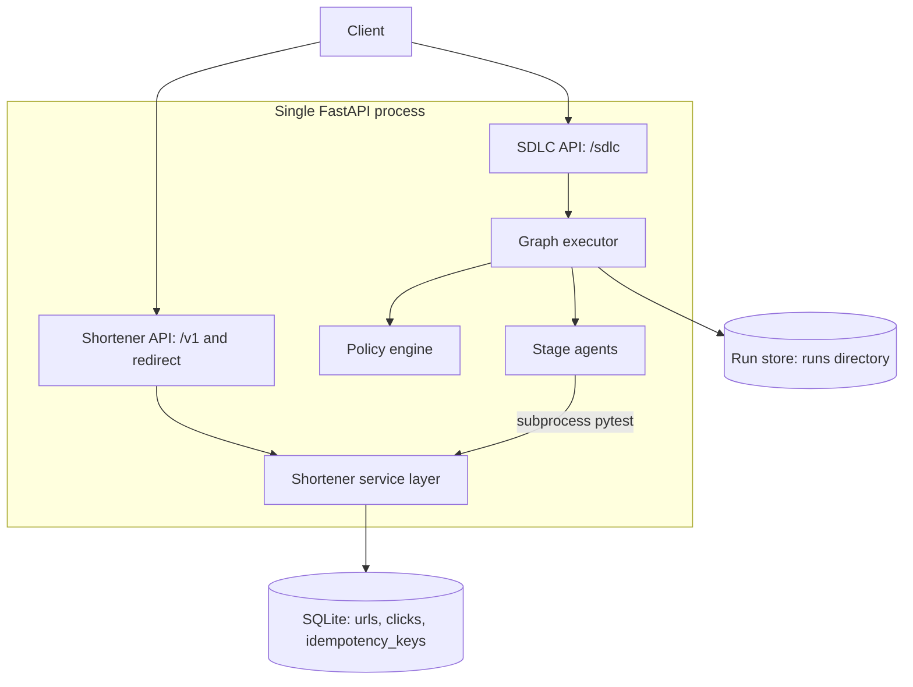
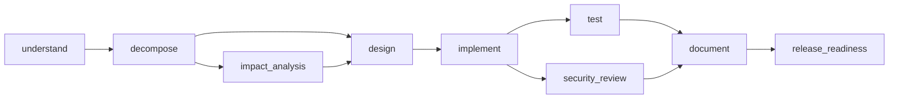
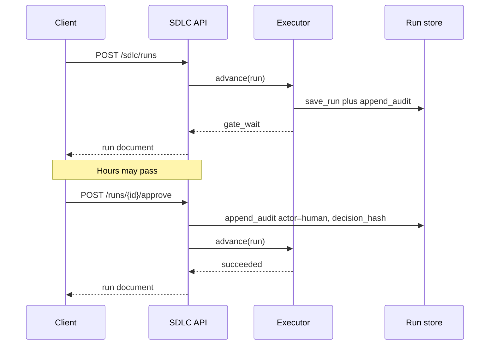
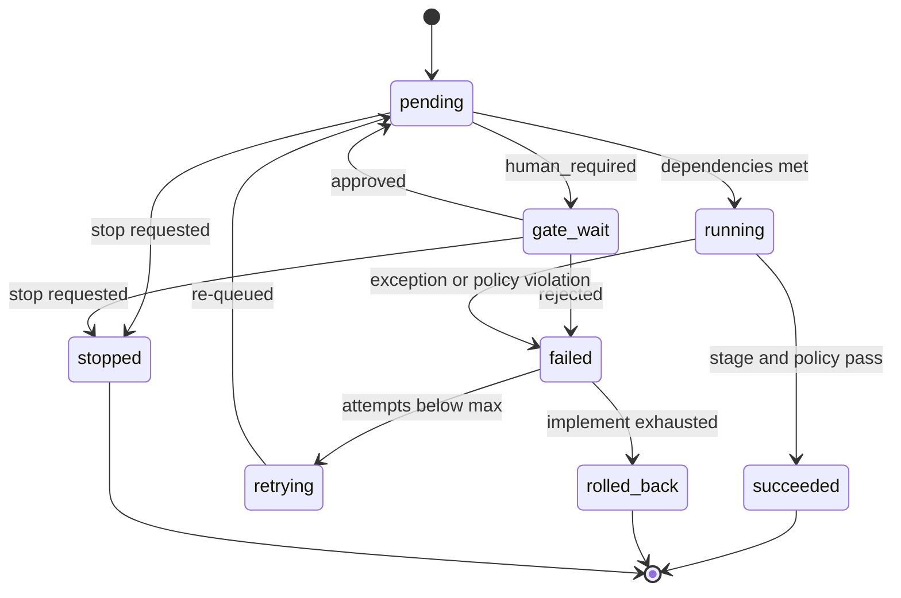

# Technical Design: Agentic SDLC Orchestrator with a URL Shortener Domain Service

| Field | Value |
|---|---|
| Status | Implemented (prototype, tagged `v0.1.0`) |
| Repository | `schintha1/agentic-url-shortener` |
| Related | [README.md](../README.md) |
| Scope | Whole system: orchestration layer and domain service |
| Audience | Engineering reviewers evaluating design judgment |

---

## 1. Overview

This system has two layers, and the distinction drives every decision in this document.

The **SDLC orchestrator** is the product. It accepts a natural-language requirement and drives it through a governed software lifecycle: understand, decompose, design, implement, test, security review, document, release. Execution is a stateful dependency graph with entry and exit gates, parallel branches with synchronization, bounded retries, rollback, safe-stop, policy guardrails, human approval checkpoints, an append-only audit trail, and reliability metrics.

The **URL shortener** is the domain artifact. It is a real, running service with short-code creation, redirects, click analytics, rate limiting, and idempotency. It exists so the orchestrator has a genuine codebase to reason about, validate against, and gate changes to. The orchestrator's `test` stage executes the shortener's real test suite as a subprocess; a failing suite fails the run.

The governing principle: **agents execute multi-step work under defined autonomy boundaries; humans own approval of high-impact actions.**

---

## 2. Goals

1. Turn a requirement into a reviewable engineering outcome with recorded decision lineage.
2. Orchestrate non-linearly: an explicit DAG with gates, not a fixed script.
3. Support sequential and parallel paths with a synchronization barrier.
4. Enforce human approval on high-impact actions (release, ambiguous assumptions).
5. Provide bounded retries, rollback, and cooperative safe-stop.
6. Enforce policy guardrails on generated artifacts before a stage is allowed to pass.
7. Emit audit-grade traces and reliability metrics (success rate, retries, rollbacks, end-to-end latency, MTTR).
8. Re-plan dynamically when upstream decisions change, without discarding audit history.
9. Ship a domain service that is genuinely production-shaped: typed boundaries, structured errors, tests.
10. Run end to end on a laptop with one command and no API keys.

## 3. Non-goals

| Non-goal | Rationale |
|---|---|
| Live LLM agents | Non-deterministic output makes a graded demo unreproducible. Interfaces stay LLM-ready. |
| Unbounded code generation | An agent rewriting the service mid-review is a reliability risk, not a feature. |
| Multi-node distributed orchestration | Single-process semantics are sufficient to demonstrate the control model. |
| Kubernetes, Docker, Terraform | Deployment packaging adds no orchestration signal. |
| Postgres, Alembic migrations | Schema is explicit in ORM models; migration tooling is a scaling concern. |
| Authentication and multi-tenancy | Out of scope for a single-tenant local prototype; called out as a limitation. |
| Autonomous deploy | Release is always human-approved by design. |

## 4. Constraints

**Hard constraints** that shaped the design:

- **C1 — No external services.** No database server, message broker, cache, or model API. A reviewer clones and runs.
- **C2 — Single process.** One `uvicorn` command must expose both layers.
- **C3 — Determinism.** Identical inputs must produce identical run outcomes so tests can assert on orchestration behavior.
- **C4 — HTTP must never block on a human.** An approval gate can be open for hours; a request handler cannot wait.
- **C5 — No secrets in the repository.** Policy scanning enforces this on generated artifacts as well as source.
- **C6 — Prototype time budget.** Roughly one working day. Any component that does not demonstrate orchestration or engineering quality was cut.
- **C7 — Python 3.11+.** Modern typing (`X | None`, `datetime.UTC`) without compatibility shims.

---

## 5. High-level design

One FastAPI application. Domain routes are mounted under `/v1` plus a catch-all redirect at `GET /{code}`. Orchestration routes are mounted under `/sdlc`.



Two persistence stores with deliberately different characteristics:

- **Relational (SQLite)** for domain data that needs queries and aggregation (click stats use `GROUP BY`).
- **Filesystem (JSON + JSONL)** for orchestration state, because a run is a document plus an append-only event log, and reviewers should be able to read it with `cat`.

Route registration order matters: the SDLC router is included **before** the shortener router, because `GET /{code}` is a catch-all that would otherwise shadow `/sdlc/...`. See [`app/main.py`](../app/main.py).

---

## 6. Detailed design

### 6.1 Application composition

[`app/main.py`](../app/main.py) exposes `create_app(settings: Settings | None = None) -> FastAPI`. Configuration is a Pydantic `Settings` object ([`app/config.py`](../app/config.py)) read from environment or `.env`.

The factory pattern is load-bearing, not stylistic. Tests construct an app with a temporary SQLite file and a temporary `runs_dir`, so no test shares database state, run state, or rate-limiter state with another. A module-level singleton app would have made rate-limit and idempotency tests order-dependent.

Startup work happens in a lifespan context: create the runs directory, create tables, enable SQLite WAL, build the session factory, and construct the rate limiter into `app.state`. Engine construction is wrapped so that an unreachable database yields a degraded app whose `/ready` returns 503 rather than a process that refuses to boot. `/health` is liveness (always 200 if the process is up); `/ready` is dependency health.

Errors use a single envelope. `AppError(status, code, message, headers)` in [`app/errors.py`](../app/errors.py) is translated by an exception handler into:

```json
{ "error": { "code": "alias_conflict", "message": "Custom alias is already in use" } }
```

Machine-readable codes in use: `url_unsafe`, `alias_conflict`, `not_found`, `expired`, `rate_limited`, `idempotency_conflict`, `code_collision`, `run_not_found`, `invalid_run_id`, `invalid_scenario`, `not_waiting`, `policy_violation`, `not_ready`. Clients never see a stack trace.

### 6.2 Orchestrator data model

[`app/orchestrator/models.py`](../app/orchestrator/models.py) defines the vocabulary as Pydantic models and enums. No magic strings for state.

- `NodeSpec` — the plan: `id`, `stage`, `requires`, `produces`, `autonomy`, `optional`, `max_retries`.
- `NodeState` — the execution record: `spec`, `status`, `attempts`, `fallback_applied`, `started_at`, `finished_at`, `error`.
- `RunState` — the whole run: nodes keyed by id, `scenario`, `requirement`, `status`, governance flags, and reliability counters (`retry_count`, `rollback_count`, `first_failure_at`, `recovered_at`).
- `AuditEvent` — one immutable transition: timestamp, node, from/to status, `actor`, message, `extra`.

Separating `NodeSpec` from `NodeState` is what makes re-planning safe: the planner produces specs, the executor owns state, and a re-plan can replace a spec without resetting attempt counts or losing history.

Node status: `pending`, `running`, `gate_wait`, `succeeded`, `failed`, `retrying`, `rolled_back`, `stopped`.
Run status: `running`, `gate_wait`, `succeeded`, `failed`, `rolled_back`, `stopped`.

### 6.3 Planner

[`app/orchestrator/planner.py`](../app/orchestrator/planner.py) exposes `plan(scenario, requirement) -> list[NodeSpec]`, a pure function with no I/O. Purity means the decomposition logic is unit-testable without HTTP, a database, or a filesystem.



Scenario shaping:

- **Greenfield** — the base graph; `design` depends on `decompose`.
- **Brownfield** — inserts `impact_analysis` between `decompose` and `design`, forcing codebase reasoning before any change is designed.
- **Ambiguous** — marks `understand` as `human_required`, so the run pauses before committing to an interpretation.

`release_readiness` is always `human_required`. Every produced graph is validated by `_assert_acyclic`, which walks dependencies with a visiting/visited set and raises on cycles or unknown dependency ids. A planner bug becomes a loud error instead of a hung executor.

`replan(run, decision)` is additive. Given a human decision requesting authentication, it appends an `apply_assumptions` node and rewrites `decompose` to depend on it. Existing nodes keep their ids, statuses, and attempt counts; the audit log is never truncated. If the human chooses `auth: none`, the graph is returned unchanged. The result is re-validated for acyclicity.

### 6.4 Executor

[`app/orchestrator/executor.py`](../app/orchestrator/executor.py) implements `async def advance(runs_dir, run) -> RunState`. One loop iteration:

1. **Safe-stop check.** If `stop_requested`, move every `pending` or `gate_wait` node to `stopped`, finalize, persist, return.
2. **Readiness.** Collect `pending` nodes whose dependencies all succeeded (or failed with a fallback applied).
3. **Gate check.** If any ready node is `human_required` and `auto_approve` is false, move those nodes to `gate_wait`, set the run to `gate_wait`, persist, and **return** — satisfying constraint C4.
4. **Snapshot.** If `implement` is about to run, copy `artifacts/` to `snapshot/`.
5. **Parallel execution.** Run the entire ready set concurrently.
6. **Retry and rollback evaluation.**
7. **Loop** until no nodes are ready or a terminal state is reached.

Concurrency uses `asyncio.gather(..., return_exceptions=True)` over per-node coroutines, each of which offloads synchronous stage work with `asyncio.to_thread`. Stage agents perform blocking file and subprocess I/O; running them directly on the event loop would serialize `test` and `security_review` and make the parallel branch a fiction.

Because `document` requires both `test` and `security_review`, and readiness only admits nodes whose dependencies have succeeded, the join is a natural consequence of the readiness rule rather than special-cased barrier code. The test asserts on audit timestamps that `document` starts only after both parallel nodes finish.

The run is persisted after every state transition batch, and each transition appends an audit event. A crash leaves a readable, truthful run document.

### 6.5 Gates and policy

Each stage has two gates. The **entry gate** is the dependency and autonomy check in the readiness pass. The **exit gate** is `check_artifacts` from [`app/orchestrator/policy.py`](../app/orchestrator/policy.py), executed inside `_run_stage_sync` immediately after the agent writes its output — before the node can be marked `succeeded`.

The policy pack is three regexes: `sk-[A-Za-z0-9]{8,}` (token-shaped secret), `password\s*=`, and `\beval\s*\(`. Files that are not valid UTF-8 are skipped rather than guessed at.

A violation raises `AppError(422, "policy_violation", "Policy rule failed: <rule_name>")`. The **rule name is reported; the matched text is not.** Echoing the matched string into an audit log that is written to disk would relocate the secret rather than block it.

### 6.6 Human-in-the-loop



`POST /sdlc/runs/{id}/approve` validates that the node is actually in `gate_wait` and returns 409 (`not_waiting`) otherwise, so a stale client cannot force a stage. Before mutating state, it appends an audit event with `actor="human"`, the reviewer's note, and a truncated SHA-256 `decision_hash` of the decision payload. That hash is the decision-lineage primitive: the exact decision that unblocked the run is provable afterward.

The approved node is flipped to `auto` for this run and set back to `pending`, and the executor resumes. For ambiguous runs, approving `understand` also triggers `replan`. `reject` fails the node and the run. `auto_approve=true` bypasses gates and exists for CI and the scripted demo only; the default is false.

### 6.7 Reliability controls

- **Retry.** After a node fails, if `attempts < max_retries` the node transitions `failed → retrying → pending`, `retry_count` increments, an audit event is written, and the loop repeats after a 10 ms yield. `implement` and `test` carry `max_retries=2`.
- **Rollback.** `implement` is the only stage with side effects worth undoing, so `artifacts/` is snapshotted before it runs. If its retries are exhausted, `restore_artifacts` puts the directory back, the node becomes `rolled_back`, and `rollback_count` increments.
- **Safe-stop.** Cooperative and checked between iterations, never mid-stage. A stage completes or fails; it is not killed halfway with partial artifacts on disk.
- **Fault injection.** `inject_failure_node` and `inject_failure_count` on the create-run request make retry, rollback, and MTTR paths testable through the public API rather than through monkeypatching internals.

### 6.8 Run store

[`app/orchestrator/store.py`](../app/orchestrator/store.py) owns the layout:

```
runs/{run_id}/
  run.json        current state (overwritten atomically)
  audit.jsonl     append-only transition log
  artifacts/      stage outputs
  snapshot/       pre-implement copy for rollback
```

Two integrity properties:

- **Atomic state writes.** `run.json` is written to `run.json.tmp` and then `os.replace`d, which is atomic on POSIX. A crash mid-write cannot leave truncated JSON that fails to parse on reload.
- **Append-only audit.** `audit.jsonl` is only ever opened in append mode. History cannot be rewritten by a later state change.

`run_id` is matched against a strict UUID regex before being joined to a path. `GET /sdlc/runs/../../etc/passwd` returns a 400 `invalid_run_id` instead of touching the filesystem.

### 6.9 Stage agents

[`app/orchestrator/agents.py`](../app/orchestrator/agents.py) dispatches a stage name to a handler that writes a typed artifact. Each artifact is a Pydantic model serialized to JSON, so shape is enforced at write time, not hoped for at read time.

| Stage | Artifact | Content |
|---|---|---|
| understand | `requirement_brief.json` | intent, ambiguities, acceptance criteria |
| decompose | `task_dag.json` | node list and rationale |
| impact_analysis | `impact.json` | modules, APIs, tables touched |
| design | `design.md` | design notes |
| implement | `implementation_report.json` | feature-to-module mapping |
| test | `test_report.json` | exit code, pass flag, captured output |
| security_review | `security_review.json` | findings |
| document | `document.md` | run notes |
| release_readiness | `release_checklist.md` | release gate checklist |
| apply_assumptions | `assumptions.json` | recorded human assumptions |

The `test` stage is not a mock. It runs `python -m pytest tests/test_shortener.py -q` as a subprocess with `cwd` pinned to the repository root, `timeout=60`, no `shell=True`, and output truncated to 8 KB before being stored. A non-zero exit code raises, which fails the node and — after retries — the run. Validation in this system is executed, not asserted.

`impact_analysis` names real files: `app/shortener/routes.py`, `app/shortener/models.py`, `app/shortener/rate_limit.py`, alongside the real endpoints and the three real tables.

### 6.10 Observability and metrics

`GET /sdlc/runs/{id}/trace` returns the parsed audit log. `GET /sdlc/metrics` scans the runs directory and computes:

| Metric | Definition |
|---|---|
| `runs_total` | run documents on disk |
| `success_rate` | succeeded / total, `0.0` when there are no runs |
| `retry_count` | summed across runs |
| `rollback_count` | summed across runs |
| `e2e_latency_ms_avg` | mean of `updated_at - created_at` |
| `mttr_ms` | mean of `recovered_at - first_failure_at` |

Metrics are derived from disk on each request, so they survive a process restart with no separate metrics store to keep consistent.

### 6.11 Domain service: URL shortener

**Code generation.** [`app/shortener/codes.py`](../app/shortener/codes.py) draws 7 Base62 characters from `secrets`, giving roughly 3.5 × 10¹² values. `secrets` rather than `random` because predictable short codes would let an attacker enumerate other users' links.

**Creation.** [`app/shortener/service.py`](../app/shortener/service.py) validates the URL, computes optional expiry, and inserts. Custom aliases map an `IntegrityError` to 409 `alias_conflict` rather than pre-checking existence, which would be a time-of-check-to-time-of-use race. Generated codes retry up to five times on collision before returning a 500.

**Redirect.** `GET /{code}` resolves the code (404 unknown, 410 expired), records a click, then returns 302. `record_click` catches `SQLAlchemyError`, rolls back, logs, and continues: **analytics failure must never break the redirect**, which is the service's primary function.

**Analytics.** `GET /v1/urls/{code}/stats` aggregates in SQL with `COUNT`, `MAX`, and `GROUP BY ... ORDER BY ... LIMIT 5`, not by pulling rows into Python.

**URL safety.** [`app/shortener/validation.py`](../app/shortener/validation.py) allows only `http` and `https`; blocks `javascript`, `file`, `data`, and `vbscript`; rejects embedded credentials; and, when `allow_private_targets` is false, blocks loopback, private, link-local, and reserved addresses. Local development defaults to permissive so the demo can shorten `localhost` URLs; production posture is the opposite.

**Rate limiting.** [`app/shortener/rate_limit.py`](../app/shortener/rate_limit.py) is a per-IP sliding window applied only to `POST /v1/shorten` — the write path. Exceeding it returns 429 with `Retry-After`. The check happens before any database work. The limiter instance lives on `app.state` so tests get a fresh one.

**Idempotency.** An `Idempotency-Key` header (capped at 128 characters) is stored with a SHA-256 hash of the canonical request body and the serialized response. Same key with same body replays the stored response; same key with a different body returns 409 `idempotency_conflict`. The key itself is never logged.

### 6.12 API surface

| Method | Path | Purpose |
|---|---|---|
| GET | `/health` | Liveness |
| GET | `/ready` | Database readiness |
| POST | `/v1/shorten` | Create short URL (alias, TTL, idempotency) |
| GET | `/v1/urls/{code}` | Metadata |
| GET | `/v1/urls/{code}/stats` | Click analytics |
| GET | `/{code}` | 302 redirect and click capture |
| POST | `/sdlc/runs` | Create and advance a run |
| GET | `/sdlc/runs/{id}` | Run state |
| GET | `/sdlc/runs/{id}/trace` | Audit trace |
| POST | `/sdlc/runs/{id}/approve` | Approve a gated node |
| POST | `/sdlc/runs/{id}/reject` | Reject a gated node |
| POST | `/sdlc/runs/{id}/stop` | Cooperative safe-stop |
| GET | `/sdlc/metrics` | Reliability metrics |

OpenAPI is generated by FastAPI at `/docs`.

---

## 7. Alternatives and trade-offs

Each decision lists the options, the choice, the reasoning, and the cost accepted.

### D1 — Single process vs. two deployable services

**Options.** (a) One FastAPI app serving both layers. (b) Separate orchestrator and shortener services communicating over HTTP.

**Chosen: one process.**

Two services would be the correct production topology — independent scaling, independent failure domains, a real network boundary the orchestrator must respect. For this system it would cost a service-discovery story, a second Dockerfile or process manager, cross-service test fixtures, and a reviewer who must start two terminals. None of that produces orchestration signal.

The boundary that actually matters is preserved anyway: [`app/orchestrator/`](../app/orchestrator/) imports nothing from [`app/shortener/`](../app/shortener/). Its only coupling to the domain is a subprocess invocation of the test suite. Splitting later is a packaging exercise, not a refactor.

**Cost accepted.** Shared process memory and lifecycle; a crash takes down both layers.

### D2 — Custom graph runner vs. an orchestration framework

**Options.** (a) Purpose-built DAG runner, roughly 250 lines. (b) LangGraph, Prefect, Temporal, or Airflow.

**Chosen: custom runner.**

A framework brings durable execution, retries, and a UI for free — genuinely valuable at scale. It also brings its own state model and vocabulary, and the specific requirements here are unusual: gates that pause on human approval without holding a request, artifact-level policy scanning between stages, additive re-planning that preserves audit history, and rollback of a filesystem snapshot. Expressing those inside a framework's abstractions means fighting the framework at exactly the points that are being evaluated.

Temporal is the strongest alternative for durable execution, but it requires a server — violating constraint C1.

**Cost accepted.** No durable execution across process restarts, no scheduler, no built-in UI. A run interrupted mid-stage is readable but not automatically resumable.

### D3 — Deterministic stage agents vs. live LLM calls

**Options.** (a) Deterministic agents producing typed artifacts. (b) LLM-backed agents. (c) Hybrid with a mock fallback.

**Chosen: deterministic agents.**

This is the decision most likely to be challenged, so the reasoning is explicit. The evaluated capability is *orchestration and governance*: does the graph gate correctly, retry correctly, roll back correctly, and record decisions provably? Every one of those properties is verified by asserting on run state. An LLM in the loop makes those assertions flaky, adds latency to every test, requires a key the reviewer may not have, and introduces prompt-injection surface — while adding nothing to the control-flow demonstration.

The architecture stays LLM-ready. `run_stage(stage, run, runs_dir)` is a dispatch boundary with typed artifact contracts. Swapping a handler for an LLM call changes one function; the gates, policy scanning, retries, and approval flow are unchanged, and they are exactly what you would want wrapped around a non-deterministic agent.

**Cost accepted.** The system does not demonstrate natural-language reasoning quality. Requirement briefs are structured rather than inferred.

### D4 — SQLite with `create_all` vs. Postgres with Alembic

**Options.** (a) SQLite, tables created at startup. (b) Postgres with versioned migrations.

**Chosen: SQLite.**

Postgres is the right production answer: real concurrency, richer types, connection pooling. It also requires a running server, which violates C1. Migrations are the more interesting question — they are a genuine change-management practice, and this system is about change management. They were still cut, because for a greenfield schema with no deployed instances, Alembic adds a directory of revision files that encode no history.

The schema is fully explicit in SQLAlchemy 2.x mapped models with typed columns, indexes, and a cascading foreign key. Moving to Postgres is a `DATABASE_URL` change plus an initial migration.

**Cost accepted.** SQLite write serialization; no concurrent writer scaling. WAL is enabled to reduce reader-writer contention.

### D5 — Filesystem run store vs. database tables

**Options.** (a) JSON document plus JSONL audit log per run. (b) Relational tables for runs, nodes, and events.

**Chosen: filesystem.**

Three reasons. First, a run is naturally a document with a nested node map; normalizing it into tables and rejoining it on every read is work with no payoff at this scale. Second, artifacts are files, so a run directory keeps state and outputs together and a reviewer can `ls` a run. Third, append-only semantics are trivially enforced with `open(..., "a")`, whereas a table requires discipline or a trigger to prevent updates.

Atomicity is handled with temp-file-plus-rename. Ordering is handled by the append-only log.

**Cost accepted.** No indexed queries across runs. `GET /sdlc/metrics` scans every run directory — O(n) per request, fine for hundreds of runs, wrong for millions.

### D6 — In-memory rate limiter vs. Redis

**Options.** (a) In-process sliding window. (b) Redis or another shared counter.

**Chosen: in-memory.**

Redis is required for correctness across multiple instances, and its absence is a real limitation — with N workers, the effective limit becomes N times the configured value. But adding Redis violates C1, and the design question being demonstrated (where to enforce, what to return, how to keep it testable) is answered identically either way.

The important details are placement and injectability: the check runs on the write path only, before any database work, and the limiter lives on `app.state` so tests get a clean instance rather than leaking counts across cases.

**Cost accepted.** Not correct across processes. Unbounded key growth (see §11).

### D7 — Sliding window vs. token bucket

**Options.** (a) Sliding window of timestamps. (b) Token bucket. (c) Fixed window.

**Chosen: sliding window.**

Fixed windows allow a double-rate burst across a boundary. Token buckets are better for smoothing sustained traffic but need refill-rate tuning to explain. A sliding window is the most accurate interpretation of "N requests per minute" and the easiest to assert on in a test.

**Cost accepted.** Memory is proportional to requests in the window per key, rather than constant per key.

### D8 — Complete the shortener up front vs. have the orchestrator generate it

**Options.** (a) Build the shortener first; the orchestrator reasons about, validates, and gates it. (b) Have the orchestrator generate the service from the requirement.

**Chosen: build it first.**

Option (b) is the more impressive demo and the worse engineering decision. Generated code would be regenerated on every run, so the `test` stage would validate a moving target, brownfield impact analysis would have no stable modules to name, and a failed generation would leave the repository broken — the artifact under review.

With (a), the orchestrator performs the work that is actually being evaluated: it names real impacted modules, runs the real test suite, applies real policy checks, and gates a real release. The [README.md](../README.md) states this explicitly rather than implying the code was agent-written.

**Cost accepted.** The `implement` stage produces a mapping report rather than a diff. This is disclosed, not hidden.

### D9 — Approval gates default closed vs. default open

**Options.** (a) `auto_approve` defaults to false. (b) Auto-approve everything unless a human opts in.

**Chosen: default closed.**

Controlled autonomy means the human is in the path by default. Defaulting open would make the demo smoother and the governance claim hollow. `auto_approve=true` exists for the test suite and the scripted demo, and both the code and the documentation label it CI-only.

**Cost accepted.** The default interactive path requires a second call to reach a terminal state.

### D10 — Execute inline in the request vs. a background worker

**Options.** (a) `advance()` runs inside the HTTP handler and returns at the first gate or terminal state. (b) A queue and worker pool with the API returning `202 Accepted` immediately.

**Chosen: inline with gate-bounded returns.**

A worker pool is the correct production answer for long-running agent work. It needs a broker (violating C1) and makes every test asynchronous with polling. Inline execution combined with the rule "never block on a human" gets most of the benefit: the request returns promptly at `gate_wait`, and the run resumes on the next approval call. Work is genuinely concurrent within a batch via `asyncio.gather`.

**Cost accepted.** A long automated stage holds the request open. With real LLM stages, this becomes untenable and D10 is the first decision to revisit.

### D11 — Random codes vs. counter or hash based

**Options.** (a) Random Base62. (b) Base62-encoded auto-increment. (c) Hash of the URL.

**Chosen: random.**

A counter is shorter and collision-free but leaks total volume and makes every other link trivially enumerable. Hashing gives free deduplication but leaks equality of targets and makes per-user TTLs awkward. Random with a retry loop keeps codes unguessable; at 62⁷ the collision probability is negligible, and five retries make it vanishing.

**Cost accepted.** A collision check on insert, and no automatic deduplication of identical URLs.

---

## 8. Failure modes

| Failure | Detection | Response | Verified by |
|---|---|---|---|
| Stage raises | Exception caught per node | `failed`, audit event with error type | `tests/test_reliability.py` |
| Transient stage failure | `attempts < max_retries` | `retrying → pending`, retry counter | `test_retry_recovers` |
| `implement` exhausts retries | Attempts exceeded | Restore snapshot, `rolled_back` | `test_implement_rollback` |
| Secret in artifact | Policy exit gate | Node fails, rule name only in audit | `tests/test_policy.py` |
| Domain tests fail | Non-zero pytest exit | `test` node fails, run fails | `test` stage contract |
| Human rejects | Explicit reject call | Node and run `failed` | `test_reject_fails_run` |
| Operator stops a run | `stop_requested` between nodes | Pending and waiting nodes `stopped` | `test_stop_leaves_stopped` |
| Approve on a non-waiting node | Status check | 409 `not_waiting` | `test_approve_wrong_state_409` |
| Malicious run id | UUID regex | 400 `invalid_run_id` | `tests/test_store.py` |
| Database unavailable | Startup and `/ready` probe | 503 `not_ready`, process stays up | `tests/test_health.py` |
| Click write fails | Caught in `record_click` | Logged; redirect still served | `app/shortener/service.py` |
| Alias collision | `IntegrityError` | 409 `alias_conflict` | `tests/test_shortener.py` |
| Rate limit exceeded | Limiter check | 429 with `Retry-After` | `test_rate_limit` |
| Duplicate submission | Idempotency lookup | Replay, or 409 on body mismatch | `test_idempotency_*` |

---

## 9. Security and privacy

**Threats considered.**

- **Open redirect / phishing.** Scheme allowlist, credential rejection, optional private-host blocking. The service will not shorten `javascript:` or `file:` URLs.
- **Server-side request forgery adjacency.** Setting `ALLOW_PRIVATE_TARGETS=false` blocks loopback, private, link-local, and reserved targets. Note this is redirect-target hygiene; the service never fetches the target itself.
- **Code enumeration.** Random 7-character codes from `secrets` plus write-path rate limiting. Short links are unguessable, not authenticated — a leaked code is a working link.
- **Secret leakage through artifacts.** Policy exit gate blocks token-shaped strings; the audit log records only the rule name.
- **Path traversal into run storage.** Strict UUID validation before any path join.
- **Injection.** SQLAlchemy parameterized queries throughout. The subprocess call uses an argument list with `shell=False` and a fixed working directory.
- **Log hygiene.** Idempotency keys are never logged. Errors return codes and messages, never stack traces.

**Privacy.** Click records store referrer and user agent, both truncated to 512 characters, indexed by short code. No IP address is persisted (it is used transiently for rate limiting). There is no retention policy or deletion endpoint — see §11.

---

## 10. Testing strategy

45 tests across the two layers, plus `ruff` as a lint gate. Both were run before every commit in the build history.

- **Domain unit** — URL validation matrix, Base62 alphabet and length.
- **Domain API** — shorten, redirect, metadata, stats; failure paths 422, 409, 410, 429, and idempotent replay.
- **Planner** — parallel branch shape, brownfield insertion, ambiguous gating, acyclicity.
- **Executor** — run completion, parallel join ordering via audit timestamps, unknown run 404, oversized requirement 422.
- **Governance** — policy denial, approve, reject, wrong-state 409.
- **Reliability** — retry recovery, implement rollback, safe-stop, all driven through the public API with fault injection.
- **Observability** — trace shape, metric bounds.
- **Scenarios** — one end-to-end test per scenario, including the ambiguous re-plan asserting that `apply_assumptions` was added and executed.

Every test uses an isolated temporary database and runs directory. The orchestrator's own `test` stage re-runs the domain suite inside the graph, which is why `tests/test_agents.py` asserts `"passed": true` inside the produced `test_report.json`.

```bash
ruff check app tests
pytest -q
python -m app.demo   # all three scenarios end to end, in process
```

---

## 11. Limitations and known gaps

Stated plainly, because an undisclosed gap is worse than a known one.

**Scale**

1. `GET /sdlc/metrics` reads every run from disk on each call. Linear cost; needs an index or rollup beyond a few thousand runs.
2. SQLite serializes writes. Redirect-heavy traffic would need Postgres and a read replica.
3. The rate limiter's key dictionary is never evicted, so distinct client IPs grow memory without bound. Production needs TTL eviction or a shared store.

**Correctness and concurrency**

4. Concurrent approve calls on the same run can interleave read-modify-write on `run.json`. There is no lock or optimistic version check. Acceptable for a single reviewer, wrong for a shared instance.
5. A process crash mid-stage leaves the run readable but not automatically resumable; there is no resume-from-disk entry point.
6. MTTR uses a heuristic: a run's `recovered_at` is set when a node in the current batch succeeds after more than one attempt. It approximates recovery time rather than measuring per-incident recovery precisely.
7. `NodeSpec.optional` and `NodeState.fallback_applied` are modeled and honored by the readiness check, but no current stage sets them, so the fallback path is structural rather than exercised.

**Security**

8. No authentication or authorization on any endpoint, including the SDLC control plane. Anyone who can reach the port can approve a release.
9. The `aws_access_key` policy rule matches a generic `sk-` token shape; it is illustrative, not a full secret-scanning ruleset.
10. No deletion or retention policy for click data.

**Functional**

11. The `implement` stage documents changes rather than producing diffs (decision D8).
12. Re-planning is triggered only by approving `understand` on an ambiguous run; it is not a general re-plan-on-any-upstream-change mechanism.
13. Custom aliases are first-come-first-served with no reserved-word list, so `health` or `docs` could be claimed as an alias — the router resolves those paths first, making such a link unreachable.

---

## 12. Future work

Ordered by value per unit of effort.

1. **Authentication on the control plane.** API keys and an approver identity, so `actor: human` names a person.
2. **Durable resume.** A `POST /sdlc/runs/{id}/resume` that reloads from disk and continues, closing gap 5.
3. **LLM stage adapters.** Implement `understand`, `decompose`, and `design` against a model behind the existing typed contracts, with the deterministic path retained as a fallback and for CI.
4. **Background execution.** Revisit D10 with a worker and `202 Accepted` once stages become slow.
5. **Postgres plus migrations.** Change `DATABASE_URL`, add Alembic, add optimistic locking on run state.
6. **Metrics rollup.** Maintain an aggregate file or table updated on run completion.
7. **Richer policy pack.** Dependency allowlists, license checks, diff-size thresholds requiring extra approval.
8. **Reserved alias list** and click-retention policy.

---

## Appendix A — Node state machine



## Appendix B — Scenarios

Packs live in [`scenarios/`](../scenarios/) and are validated by a Pydantic model.

| Scenario | Requirement | Orchestration behavior |
|---|---|---|
| Greenfield | Build a URL shortener with core APIs | Base DAG; parallel test and security review; human release gate |
| Brownfield | Add analytics and rate limiting to the existing URL shortener | `impact_analysis` inserted before design; names real modules, APIs, tables |
| Ambiguous | Make it enterprise-ready | `understand` gates for a human; approval carries assumptions; additive re-plan adds `apply_assumptions` |

`python -m app.demo` runs all three in process and prints a summary.

## Appendix C — Repository layout

```
app/
  config.py            settings
  errors.py            AppError and the error envelope
  main.py              create_app factory, health and readiness
  demo.py              three-scenario runner
  shortener/           domain service
    codes.py db.py models.py rate_limit.py routes.py schemas.py service.py validation.py
  orchestrator/        SDLC engine
    agents.py executor.py models.py planner.py policy.py routes.py scenario_pack.py schemas.py store.py
scenarios/             greenfield, brownfield, ambiguous
tests/                 45 tests
docs/DESIGN.md         this document
```
